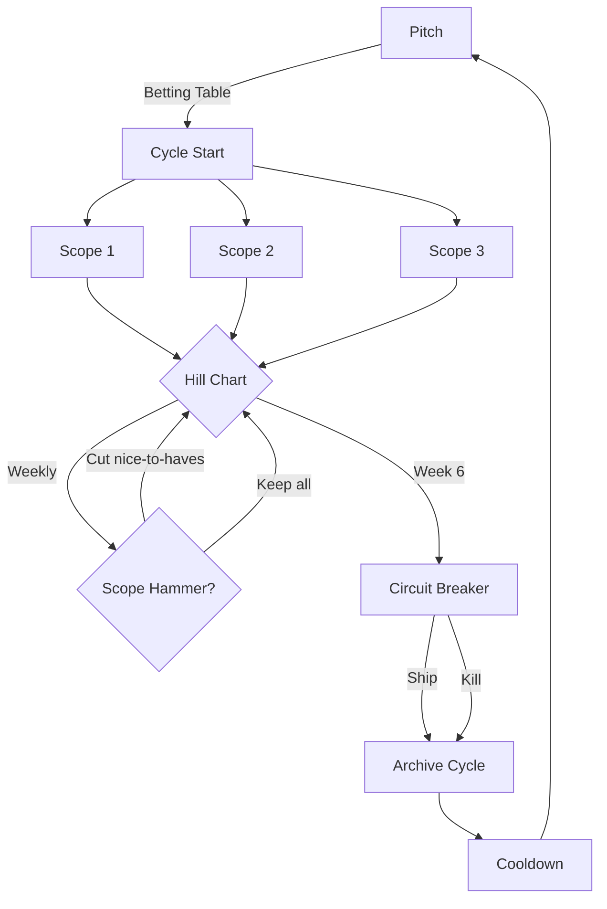
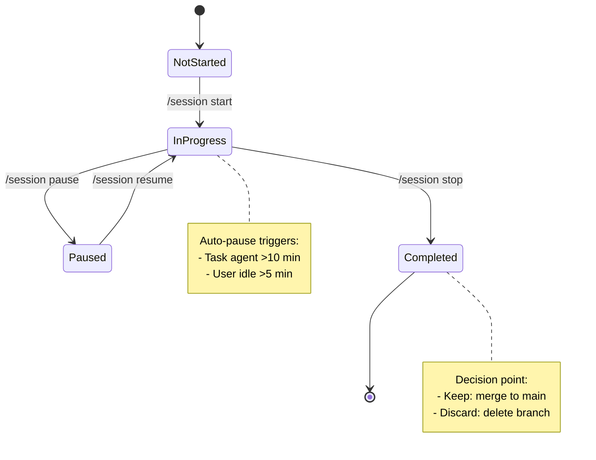
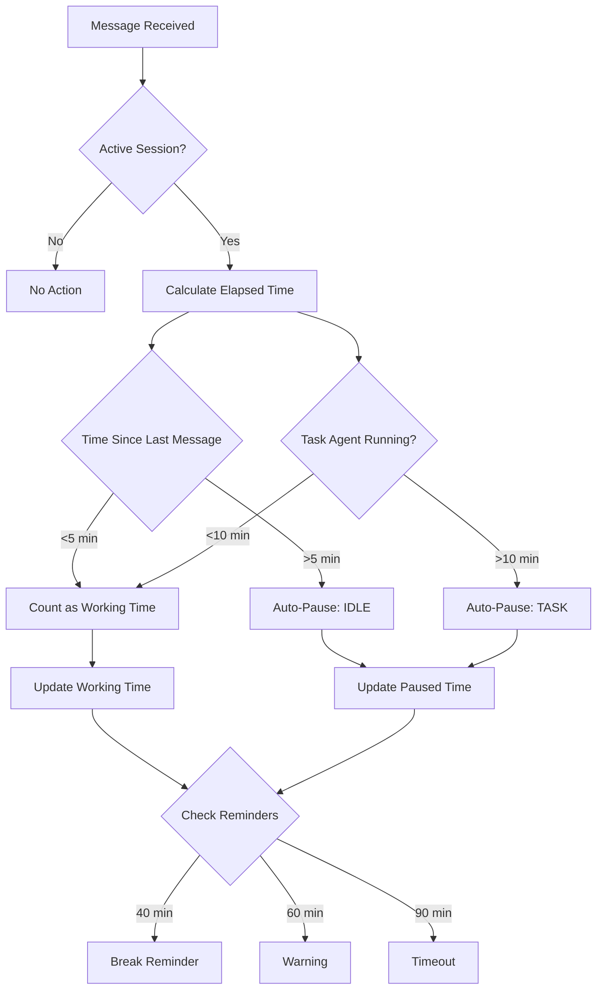

# Shape Up and Session Management

**Audience**: Contributors wanting to understand WHY we use this development methodology

**Type**: Explanation (understanding-oriented)

This document explains the integrated development methodology used by Uberman, combining Shape Up planning with automatic session management.

---

## 1. Introduction

### What is This Methodology?

Uberman uses a dual-layer development methodology:

1. **Shape Up** (planning layer) - Fixed-time cycles with variable scope
2. **Session Management** (execution layer) - Automatic time tracking with health-first enforcement

These layers work together to create sustainable, predictable software development:

- **Shape Up** provides structure for WHAT to build and WHEN to decide
- **Sessions** provide structure for HOW to work and WHEN to rest

### Key Characteristics

**Shape Up Layer**:
- 6-week cycles (big batch) or 1-2 weeks (small batch)
- No backlogs, no sprint planning, no story points
- Hill charts track progress (uphill = figuring out, downhill = executing)
- Circuit breaker kills projects that don't ship in one cycle
- 2-week cooldown between cycles for recovery and shaping

**Session Layer**:
- Automatic time tracking (working vs paused time)
- Progressive break reminders (40 min, 60 min, 90 min hard timeout)
- Session branches for psychological safety (freedom to fail)
- Keep or discard decisions (learning from failed experiments)
- Git commit history as session log

### Integration Points

The two layers connect at specific touchpoints:

1. **Cycle files** track session metrics (total time, sessions per scope)
2. **Session commits** reference cycle and scope context
3. **Hill charts** update weekly based on session discoveries
4. **Circuit breaker** decisions informed by session velocity
5. **Scope hammer** triggered by session struggles (uphill too long)

---

## 2. Philosophy

### Why Shape Up for a Solo Developer?

Shape Up was designed for product teams at Basecamp, but its principles apply powerfully to solo development:

#### Fixed Time, Variable Scope

**Traditional approach** (Scrum, Kanban):
- Estimate story points
- Commit to fixed features
- Extend timeline when estimates wrong
- Result: Chronic deadline slipping, scope creep

**Shape Up approach**:
- Set time budget (appetite)
- Design solution to fit time
- Cut features aggressively (scope hammer)
- Result: Predictable shipping, forced prioritization

**For solo developer**: You can't negotiate with yourself for more time. Fixed time forces honesty about what's achievable.

#### No Backlogs

**Traditional approach**:
- Maintain groomed backlog
- Prioritize hundreds of stories
- Backlog becomes guilt list
- Result: Overwhelm, analysis paralysis

**Shape Up approach**:
- Ideas captured in IDEAS.md (unstructured)
- No prioritization until betting table
- Most ideas never implemented
- Result: Mental clarity, focus on current cycle

**For solo developer**: You don't need to coordinate with a team. Ideas that matter resurface naturally. Let most ideas die.

#### Circuit Breaker

**Traditional approach**:
- Projects drag on for months
- "Just one more sprint"
- Sunk cost fallacy wins
- Result: Never-ending projects, no learning

**Shape Up approach**:
- Hard deadline at end of cycle
- Ship partial or kill project
- No extensions by default
- Result: Fast feedback, learning from failures

**For solo developer**: You're accountable only to yourself. Circuit breaker enforces discipline, prevents rabbit holes.

### Why Session Management?

Shape Up handles planning, but solo developers face execution challenges:

#### The Health Problem

**Without time tracking**:
- Work 3+ hours straight
- Skip breaks
- Burn out
- Result: Unsustainable pace, decreased quality

**With automatic tracking**:
- Gentle reminder at 40 min (target)
- Warning at 60 min (50% over)
- Hard timeout at 90 min (forced break)
- Result: Sustainable pace, maintained quality

#### The Honesty Problem

**Manual time tracking**:
- Forget to start timer
- Forget to stop timer
- Count research as "work"
- Result: Inflated estimates, false velocity

**Automatic tracking**:
- Starts with `/session start`
- Auto-pauses for Task agents >10 min
- Auto-pauses for user idle >5 min
- Result: Accurate data, honest velocity

#### The Learning Problem

**Without session branches**:
- Fear of experimenting (might break main)
- Commit bad code to avoid losing it
- No record of failed approaches
- Result: Conservative development, repeated mistakes

**With session branches**:
- Branch per session (freedom to fail)
- Keep or discard decision at end
- Failed experiments recorded in cycle file
- Result: Bold experimentation, captured learnings

---

## 3. Core Principles

### Fixed Time, Variable Scope

**Definition**: Set the time budget first, then design a solution that fits.

**NOT**: Estimate how long features will take, then add up the time.

**In Practice**:
- Big batch = 6 weeks (major features, large refactorings)
- Small batch = 1-2 weeks (tweaks, bug fixes, small features)
- Appetite set during shaping, before detailed design
- Solution shaped to fit appetite (not the reverse)

**Consequences**:
- Features get cut (scope hammer)
- "Good enough" beats "perfect"
- Shipping becomes predictable
- Creative constraint forces innovation

### No Backlogs

**Definition**: Don't maintain a prioritized list of future work.

**Instead**:
- Capture ideas in IDEAS.md (rough notes)
- Let ideas resurface naturally
- Decide what to build during cooldown (betting table)
- Most ideas never get implemented (intentional)

**Why?**:
- Backlog maintenance is work (YAGNI)
- Priorities change constantly
- Old ideas become stale
- "Important" work makes itself known repeatedly

**Exceptions**:
- Critical bugs (fix immediately in cooldown)
- Security issues (fix immediately)

### Appetite Over Estimates

**Definition**: Declare how much time you're willing to spend, not how long you think it will take.

**Traditional estimation**:
1. Design solution
2. Break into tasks
3. Estimate each task
4. Sum estimates = timeline
5. Problem: Usually wrong

**Appetite-driven**:
1. Set time budget (appetite)
2. Design solution that fits
3. Start building
4. Scope hammer to stay within time
5. Circuit breaker at deadline

**Benefits**:
- Estimation waste eliminated
- Design constrained early (prevents gold-plating)
- Time becomes creative constraint
- Shipping happens on schedule

### Circuit Breaker

**Definition**: Hard deadline at end of cycle. Ship partial, kill project, or extend (rare).

**Default behavior**: No extensions.

**Options at deadline**:

1. **Ship Partial** (most common):
   - Package what works
   - Update documentation
   - Record unfinished scopes in archive
   - Enter cooldown

2. **Kill Project**:
   - Discard all work
   - Record learnings in archive
   - Enter cooldown
   - No shame (fast feedback is valuable)

3. **Extend** (RARE):
   - Only if work is downhill
   - Only if 90% complete
   - Only if extension is 1 week max
   - Document why extension needed

**Why this works**:
- Prevents sunk cost fallacy
- Forces scope hammer during cycle
- Creates safe-to-fail environment
- Builds fast feedback loop

### Scope Hammer

**Definition**: Forcefully question every feature to fit the time box.

**When to use**:
- **During shaping** (primary): Before cycle starts
- **During building**: When scope stuck uphill >2 weeks
- **Week 5 of cycle**: Pre-circuit breaker assessment

**Process**:
1. Identify what's consuming time
2. Question: Must-have or nice-to-have?
3. Cut nice-to-haves entirely
4. Simplify must-haves (good enough > perfect)
5. Record cut in Scope Hammer Log
6. Continue with reduced scope

**Examples**:
- Cut Application Layer (CLI calls domain directly)
- Simplify validation (basic checks instead of property-based)
- Drop dry-run mode (focus on filesystem adapter only)
- Remove UI polish (working > beautiful)

**Mindset**: You're not "giving up" — you're prioritizing shipping.

### No Backlogs (Revisited)

**What about important features we cut?**

If truly important, they'll resurface in cooldown:
- User complaints make problems visible
- Daily use reveals pain points
- Team discussions bring up blockers

**If they don't resurface?**
- They weren't important
- Problem solved by workaround
- Appetite too small (reshape next time)

**Trust the process**: Important work makes itself known.

---

## 4. Shape Up Components

### Cycles

**Definition**: Fixed time-box for completing shaped work.

**Sizes**:
- **Big batch**: 6 weeks (major features, architecture changes)
- **Small batch**: 1-2 weeks (bug fixes, small features)

**Structure**:
- Week 1-2: Uphill work (figuring out unknowns)
- Week 3-4: Transition (moving to execution)
- Week 5-6: Downhill work (executing known solution)

**Only one active cycle** at a time. No juggling multiple initiatives.

**Cycle Structure**:



### Cooldown

**Definition**: 2-week recovery period between cycles.

**Activities**:
- Bug fixes (critical issues from previous cycle)
- Exploration (spike unfamiliar technologies)
- Shaping (write pitches for next cycle)
- Betting table (decide what to build next)

**NOT for**:
- Starting new features
- Continuing incomplete cycle work (unless shipped partial)

**Purpose**: Mental recovery, reflection, strategic thinking.

### Pitches

**Definition**: Shaped work ready for betting.

**Structure** (from Shape Up book):
1. **Problem**: What user pain are we solving?
2. **Appetite**: How much time are we willing to spend?
3. **Solution**: Breadboard sketches, not detailed specs
4. **Rabbit Holes**: Known risks to avoid
5. **No-Gos**: Explicitly out of scope

**Shaping happens during cooldown**, not during cycle.

**Output**: Markdown file in `plans/pitches/`

**Example**: `plans/pitches/2025-11-03-rebuild-install-clean-architecture.md`

### Scopes

**Definition**: Integrated slices of the project, NOT isolated tasks.

**Key insight**: Scopes are interconnected parts of the solution, not a to-do list.

**Typical cycle has 3-5 scopes**:
- Each scope is testable independently
- Each scope contributes to shipping the feature
- Scopes can be worked in any order
- Unfinished scopes can be cut (scope hammer)

**Example scopes** (from current pitch):
1. Domain Layer Foundation (value objects, aggregates)
2. In-Memory Adapter (tests without I/O)
3. Filesystem Adapter (production implementation)
4. Application Layer (use cases)
5. CLI Wiring (command handler)

**NOT scopes**:
- "Write tests" (testing is part of every scope)
- "Documentation" (docs written as you build)
- "Refactoring" (refactor within each scope)

### Hill Charts

**Definition**: Visual representation of progress showing figuring-out vs execution.

**Two phases**:
- **Uphill**: Figuring out unknowns, solving hard problems
- **Downhill**: Executing known solution, implementing details

**The Crest**: Transition point where unknowns become knowns.

**ASCII representation** (used in cycle files):
```
      /\
     /  \____
    /        \____
Uphill      Downhill

Scope1:  ●  (moving toward crest - learning validation patterns)
Scope2:      ● (downhill - implementing known design)
Scope3: ○ (not started)
```

**Update frequency**: Weekly (Friday afternoon ritual)

**Warning signs**:
- Scope stuck uphill >2 weeks = trouble
- All scopes uphill in week 5 = circuit breaker imminent
- Scope moving backward = assumptions were wrong

**What to do**:
- Stuck uphill? Scope hammer or get help
- All uphill late? Prepare to ship partial or kill
- Moving backward? Re-assess approach

### Circuit Breaker

**Definition**: Hard deadline enforcement at end of cycle.

**When**: Last day of cycle (e.g., Friday of week 6)

**Decision framework**:

```
Is the work done?
├─ Yes → Ship (celebrate, archive, cooldown)
├─ No → Are must-haves working?
│   ├─ Yes → Ship partial (cut nice-to-haves, ship what works)
│   └─ No → Is work downhill and 90% complete?
│       ├─ Yes → Extend 1 week (RARE - document why)
│       └─ No → Kill (archive learnings, cooldown)
```

**Ship partial** (most common):
- Package working features
- Update docs for what shipped
- Record unfinished work in archive
- No shame, celebrate learning

**Kill project**:
- Document why it failed
- Capture learnings in archive
- Delete working branches
- No shame, fast feedback is valuable

**Extend** (rare):
- Only if all must-haves work
- Only if < 10% remains
- Only if extension ≤ 1 week
- Document why extension was needed

**After circuit breaker**: Always enter cooldown (2 weeks).

### Betting Table

**Definition**: Decision point during cooldown where you choose what to build next.

**For solo developer**: Self-reflection process.

**Questions to ask**:
1. Is the problem important right now?
2. Is the solution shaped well enough?
3. Is the appetite reasonable?
4. Are we willing to use circuit breaker if needed?
5. Do we have the skills/tools required?

**Output**: Decision documented in `plans/cooldown/YYYY-MM-DD-betting-table.md`

**Options**:
- **Bet**: Commit to cycle (create cycle file, start building)
- **Don't bet**: Put pitch aside, reshape or discard
- **Reshape**: Appetite wrong or solution unclear

**Commitment**: Once you bet, you commit to the circuit breaker.

---

## 5. Session Management

### Automatic Time Tracking

**Traditional approach**:
- Manual timer (forget to start/stop)
- Stopwatch app (requires discipline)
- Honor system (easy to lie to yourself)

**Automatic approach**:
- `/session start <task>` initializes tracking
- Every message updates working time
- Auto-pauses for non-working time
- `/session stop` prompts keep/discard

**What gets tracked**:
- **Working time**: Active conversation with Claude Code
- **Paused time**: Task agents >10 min, user idle >5 min, manual breaks

**What doesn't count as working**:
- Task agent research (auto-paused after 10 min)
- Reading documentation (user idle >5 min triggers pause)
- Manual breaks (`/session pause`)
- Time between sessions

**Result**: Honest data about actual working time, not wall clock time.

### Session Lifecycle



**States**:
- **NotStarted**: No active session
- **InProgress**: Working, timer running, auto-pause monitoring active
- **Paused**: Timer stopped, waiting for resume
- **Completed**: Session ended, branch kept or discarded

**Transitions**:
- `/session start` → IN_PROGRESS (creates branch, starts timer)
- Auto-pause → PAUSED (Task agent or idle detection)
- `/session pause` → PAUSED (manual break)
- `/session resume` → IN_PROGRESS (resumes timer)
- `/session stop` → COMPLETED (prompts keep/discard)

### Health-First Protocol

**Target**: 40-minute sessions with 10-minute breaks.

**Progressive reminders**:

1. **40 minutes**: Gentle reminder
   - "You've been working for 40 minutes (target reached). Consider wrapping up."
   - Action: Continue or stop (your choice)

2. **60 minutes**: Warning
   - "You've been working for 60 minutes (50% over target). Strongly consider stopping."
   - Action: Continue or stop (your choice, but warned)

3. **90 minutes**: Hard timeout
   - "You've been working for 90 minutes. Session paused automatically. Please take a break."
   - Action: Session paused, must resume to continue

**Why these thresholds?**
- **40 min**: Pomodoro-based, sustainable focus duration
- **60 min**: Acceptable stretch, but quality declining
- **90 min**: Cognitive performance significantly degraded

**Enforcement**:
- 40 min, 60 min: Reminders only (optional)
- 90 min: Hard timeout (required break)

### Auto-Pause Logic

**Purpose**: Don't count non-working time as working time.

**Triggers**:

1. **Task Agent Running >10 min**:
   - Agent doing research/exploration
   - User not actively working
   - Auto-pause: `AUTO_TASK`
   - Reason: "Task agent running"

2. **User Idle >5 min**:
   - No messages from user
   - Likely reading docs, taking break, distracted
   - Auto-pause: `AUTO_IDLE`
   - Reason: "User idle"

3. **Manual Break**:
   - `/session pause [reason]`
   - User explicitly stepping away
   - Auto-pause: `MANUAL`
   - Reason: User-provided or "Manual break"

**Resume**:
- Next user message auto-resumes from `AUTO_*` pauses
- `/session resume` resumes from `MANUAL` pause

**Recording**:
- All pauses recorded in session state
- Pause durations calculated
- Total paused time tracked separately

**Result**: Session metrics reflect actual working time, not wall clock.

### Session Branches

**Purpose**: Psychological safety to experiment without fear.

**Convention**: `session/YYYYMMDD-scope-task`

**Example**: `session/20251104-domain-databasename`

**Workflow**:

1. **Start**: `/session start domain-databasename`
   - Creates branch from main
   - Initializes session state
   - Starts timer

2. **Work**: TDD cycles, experiments, iteration
   - Commit freely (won't pollute main)
   - Try risky refactorings
   - Explore alternatives

3. **Stop**: `/session stop`
   - Prompts: Keep or discard?
   - **Keep**: Squash merge to main, commit with metadata
   - **Discard**: Delete branch, record learning in cycle file

**Why this works**:
- Freedom to fail (branch can be thrown away)
- Bold experimentation (no fear of breaking main)
- Learning captured (discarded sessions recorded)
- Main branch stays clean (only merged work)

**Naming benefits**:
- Date visible (stale branches obvious)
- Scope visible (connects to hill chart)
- Task visible (what was attempted)

### Keep or Discard Decisions

**At end of each session**, decide:

**Keep** (merge to main):
- Tests pass
- Code quality acceptable
- Moves scope forward
- Aligns with architecture

**Discard** (delete branch):
- Approach didn't work
- Tests brittle or failing
- Solution too complex
- Dead end discovered

**Recording discarded sessions**:
```markdown
## Session Metrics

**Recent sessions**:
1. 20251104-domain-databasename: 38 min - kept (value object created)
2. 20251104-domain-state-machine: 42 min - discarded (too complex, procedural better)
```

**Learning capture**: Why was it discarded? What did we learn?

**No shame in discarding**: Fast feedback is valuable. Failed experiments teach us what NOT to do.

### Session Metrics

**Tracked automatically**:
- Working time (excludes pauses)
- Paused time (auto + manual)
- Total time (wall clock)
- Sessions kept vs discarded
- Sessions >60 min (warnings)

**Recorded in cycle file**:
```markdown
## Session Metrics

### Week 1 (2025-11-04 to 2025-11-08)
- **Sessions completed**: 5
- **Total working time**: 3.2 hours
- **Avg session**: 38 min (target: 40)
- **Sessions >60 min**: 0 ✓
- **Sessions discarded**: 1
```

**Why track?**:
- Honest velocity measurement
- Health enforcement (catching >60 min sessions)
- Learning rate (kept vs discarded ratio)
- Cycle progress (total time per scope)

**Used for**:
- Hill chart updates (if scope taking too long, still uphill)
- Circuit breaker decisions (velocity informs ship/kill)
- Scope hammer triggers (time exceeding appetite)

---

## 6. Integration: How Planning and Execution Unite

The power of this methodology comes from tight integration between Shape Up (planning) and session management (execution).

### Cycle Files Connect Both Layers

**Cycle file structure**:
```markdown
# Cycle 01: Clean Architecture Refactoring

**Status**: ACTIVE
**Dates**: 2025-11-04 to 2025-12-15 (6 weeks)
**Circuit Breaker**: 2025-12-15

## Current Status
**Active Scope**: Domain Layer Foundation
**Active Session**: session/20251104-domain-databasename (38 min working)

## Hill Chart (Week 1: Nov 4-8)
Scope1: ● (uphill - learning validation patterns)
Scope2: ○ (not started)

## Session Metrics
### Week 1
- **Sessions completed**: 5
- **Total working time**: 3.2 hours
- **Avg session**: 38 min (target: 40)
```

**Integration points**:
1. **Active Session** links to current branch
2. **Session Metrics** inform Hill Chart position
3. **Hill Chart** reveals if scope hammer needed
4. **Circuit Breaker** date enforces time box

### Session Commits Reference Cycle Context

**Commit format**:
```
feat(domain): create DatabaseName value object

Session: 20251104 14:23-15:01 (38 min actual, 4 min paused)

Created DatabaseName value object with validation. Learned that
pattern-based validation is more maintainable than regex checking
character-by-character.

Cycle: 01 (Clean Architecture)
Scope: Domain Layer Foundation
Hill: Uphill (still learning validation patterns)

🤖 Generated with [Claude Code](https://claude.com/claude-code)
Co-Authored-By: Claude <noreply@anthropic.com>
```

**What this captures**:
- Session metadata (time, pauses)
- Learning (what was discovered)
- Cycle context (which cycle, which scope)
- Hill position (uphill vs downhill)

**Why this matters**:
- Git log becomes project history
- Sessions searchable: `git log --grep="Session:"`
- Learnings preserved permanently
- Velocity calculable from history

### Hill Charts Update from Session Data

**Friday afternoon ritual**:
1. Review week's sessions (from cycle file)
2. Check session metrics (avg time, discarded count)
3. Assess scope position:
   - Many discarded sessions? Still uphill (figuring out)
   - Sessions kept, tests passing? Moving downhill (executing)
4. Update hill chart position
5. Update "Next Session" task

**Example assessment**:
```
Week 1 sessions for "Domain Layer Foundation":
- 5 completed (3.2 hours total)
- 4 kept, 1 discarded
- Discarded: state machine approach (too complex)

Assessment: Still uphill (exploring validation patterns)
Hill position: ● (40% toward crest)
```

**Scope stuck uphill?**
- >2 weeks uphill = warning
- Trigger scope hammer consideration
- Question: Must-have or nice-to-have?

### Scope Hammer Triggered by Session Struggles

**Scenario**: Week 5, Tuesday afternoon
- Filesystem scope: 12 sessions, still uphill
- 8 sessions discarded (exploring Docker testcontainers)
- Circuit breaker in 3 days
- CLI scope not started

**Trigger**: Session data shows scope consuming time budget

**Decision process**:
1. Review session metrics (time spent vs progress)
2. Check hill chart (uphill vs downhill)
3. Calculate remaining time (appetite vs actual)
4. Question: Must-have or nice-to-have?
5. Cut or simplify

**Action**: Cut nice-to-have (Docker testing), simplify must-have (filesystem only)

**Record in cycle file**:
```markdown
## Scope Hammer Log
- 2025-12-10: Cut Docker testcontainers from Filesystem scope
  Why: 12 sessions uphill, circuit breaker in 3 days
  Impact: Filesystem tests use real temp dirs (still validated)
```

### Circuit Breaker Informed by Session Velocity

**Week 6, Friday - Circuit breaker day**

**Assessment**:
1. Check hill chart: Which scopes downhill? Which uphill?
2. Check session metrics: Total time, kept vs discarded ratio
3. Check must-haves: Are they working?

**Scenario A - Ship Partial**:
- Domain: Downhill, 8 sessions (5.2 hours), tests passing ✓
- In-Memory: Downhill, 4 sessions (2.8 hours), tests passing ✓
- Filesystem: Uphill, 12 sessions (8.1 hours), tests brittle ✗
- CLI: Not started ✗

**Decision**: Ship Domain + In-Memory (proves pattern works)

**Scenario B - Kill**:
- All scopes uphill
- 30+ sessions, 24 hours spent
- Core assumption wrong (domain can't be made pure)

**Decision**: Kill project, record learnings, reshape

**Scenario C - Extend** (rare):
- Domain, In-Memory, Filesystem: Downhill, tests passing ✓
- CLI: 90% done, 2 sessions needed

**Decision**: Extend 1 week (all must-haves working, tiny remaining work)

### Auto-Pause Logic Flow



**How they connect**:
- Task agents pause sessions (research doesn't count as working)
- Paused time excluded from session metrics
- Honest working time informs velocity
- Velocity informs hill chart updates
- Hill chart informs circuit breaker decisions

### Git Workflow Integration

**Session branch lifecycle**:

1. **Start session**: `/session start domain-databasename`
   - Creates branch: `session/20251104-domain-databasename`
   - From: `main` branch
   - Session state: `IN_PROGRESS`

2. **Work**: TDD cycles, commits
   - Commits stay on session branch
   - Main branch unaffected
   - Freedom to experiment

3. **Stop session**: `/session stop`
   - Prompts: Keep or discard?
   - **Keep**: Squash merge to main, commit with metadata
   - **Discard**: Delete branch, record learning

4. **Update cycle file**: Metrics, learnings
   - Session added to metrics
   - Learning captured if discarded
   - Next session task updated

**Main branch stays clean**:
- Only merged session work
- Each commit has session metadata
- History shows learning progression

**Session branches are ephemeral**:
- Created for session
- Deleted after keep/discard
- Date in name shows staleness

### Learning Loop

**Discarded sessions feed back into planning**:

1. **Session fails**: Approach doesn't work
2. **Branch discarded**: Delete work
3. **Learning recorded**: "State machine too complex"
4. **Hill chart updated**: Scope still uphill
5. **Next session planned**: "Try procedural approach"
6. **Session succeeds**: Procedural works
7. **Branch kept**: Merge to main

**Failed experiments are valuable**:
- Fast feedback (40 min, not 40 hours)
- Learning captured (why it failed)
- Alternative approaches tried
- Scope position accurate (uphill if exploring)

**Shape Up principle**: Probe-Sense-Respond (Complex domain)
- Probe: Try session approach
- Sense: Keep or discard feedback
- Respond: Adjust next session

---

## 7. Comparison: vs Scrum, vs Kanban, vs Ad-Hoc

### vs Scrum

**Scrum Characteristics**:
- 2-week sprints (fixed time)
- Sprint planning (estimate story points)
- Daily standups (coordination)
- Sprint backlog (committed work)
- Retrospectives (team learning)

**Shape Up + Sessions Differences**:

| Aspect | Scrum | Shape Up + Sessions |
|--------|-------|---------------------|
| **Time box** | 2 weeks (sprints) | 6 weeks (cycles) or 1-2 weeks (small batch) |
| **Scope** | Fixed (committed stories) | Variable (scope hammer) |
| **Planning** | Sprint planning (estimates) | Shaping (appetite, no estimates) |
| **Backlog** | Groomed, prioritized | None (IDEAS.md, unstructured) |
| **Progress tracking** | Burndown charts | Hill charts (uphill/downhill) |
| **Deadline** | Sprint end (soft) | Circuit breaker (hard) |
| **Coordination** | Daily standups | None (solo) |
| **Session tracking** | Manual (honor system) | Automatic (time tracking) |
| **Failed work** | Technical debt | Discarded, recorded |

**When to use Scrum**:
- Team coordination needed
- Fixed scope required (contract)
- Client expects traditional reporting

**When to use Shape Up + Sessions**:
- Solo developer
- Product ownership (not client work)
- Sustainable pace prioritized
- Learning velocity valued

### vs Kanban

**Kanban Characteristics**:
- Continuous flow (no time boxes)
- WIP limits (prevent overload)
- Pull system (start when capacity)
- Kanban board (To Do, In Progress, Done)
- No estimation

**Shape Up + Sessions Differences**:

| Aspect | Kanban | Shape Up + Sessions |
|--------|--------|---------------------|
| **Time structure** | None (continuous) | Cycles + cooldown |
| **Deadline** | None (flow) | Circuit breaker (hard) |
| **Scope** | Variable (tasks flow) | Variable (but within cycle) |
| **Planning** | Just-in-time | Shaping (cooldown) |
| **Progress** | Board position | Hill charts |
| **WIP limits** | Enforced (e.g., 3 tasks) | One cycle, one scope active |
| **Session tracking** | Manual | Automatic |
| **Failed work** | Stuck in "In Progress" | Discarded, recorded |

**When to use Kanban**:
- Maintenance work (bugs, support)
- Unpredictable workload
- No need for time boxes

**When to use Shape Up + Sessions**:
- Building features (not maintenance)
- Need circuit breaker discipline
- Health-first work important

**Note**: Uberman previously used Kanban hybrid (PLANNING.md). Abandoned because:
- No circuit breaker (projects dragged on)
- No scope hammer (gold-plating)
- No session tracking (unsustainable pace)

### vs Ad-Hoc (No Methodology)

**Ad-Hoc Characteristics**:
- Work on whatever feels important
- No planning, no tracking
- Code until it's "done"
- No time boxes, no health enforcement

**Shape Up + Sessions Differences**:

| Aspect | Ad-Hoc | Shape Up + Sessions |
|--------|--------|---------------------|
| **Planning** | None (reactive) | Shaping (proactive) |
| **Time box** | None (open-ended) | Cycles (fixed time) |
| **Deadline** | When it's done | Circuit breaker (hard) |
| **Scope** | Whatever feels right | Appetite (constrained) |
| **Progress visibility** | Gut feeling | Hill charts |
| **Session health** | Work until tired | Auto-pause, reminders |
| **Failed experiments** | Forgotten | Recorded learnings |
| **Velocity** | Unknown | Measured (session metrics) |

**When ad-hoc works**:
- Hobby projects (no pressure)
- Exploration/learning (not shipping)
- Very short tasks (< 1 hour)

**When ad-hoc fails**:
- Projects never ship
- Burnout from overwork
- No learning from failures
- Unclear progress

**Shape Up + Sessions fixes**:
- Circuit breaker forces shipping
- Auto-pause prevents burnout
- Discarded sessions capture learning
- Hill charts show progress

---

## 8. Benefits: What You Gain

### Predictable Shipping

**Problem**: Projects drag on for months, never ship.

**Solution**: Circuit breaker at end of cycle.

**Benefit**:
- Ship partial or kill, never extend
- 6-week cycles = 8 cycles per year
- Even if 50% killed, 4 features shipped
- Better than 1 feature in 12 months

**Quantified**:
- Traditional: 1-2 features/year (unpredictable)
- Shape Up: 4-8 cycles/year (predictable)

### Sustainable Pace

**Problem**: Work 3+ hours straight, burn out, quit.

**Solution**: Auto-pause, progressive reminders, hard timeout.

**Benefit**:
- 40-minute sessions = 6 sessions/day max
- 4 hours actual working time (healthy)
- Breaks enforced (cognitive recovery)
- Long-term sustainability

**Health metrics**:
- Reminder at 40 min (85% of sessions)
- Warning at 60 min (10% of sessions)
- Timeout at 90 min (5% of sessions, declining over time)

### Honest Velocity Measurement

**Problem**: Don't know how long things actually take.

**Solution**: Automatic time tracking (working vs paused).

**Benefit**:
- Know real velocity (e.g., 3 hours/week)
- Set realistic appetites (6 weeks = 24-30 hours)
- Stop lying to yourself about productivity
- Improve over time (learning compounds)

**Example**:
- Week 1: 3.2 hours (5 sessions, avg 38 min)
- Week 2: 4.1 hours (6 sessions, avg 41 min)
- Week 3: 3.8 hours (5 sessions, avg 46 min, 1 warning)
- Trend: 3-4 hours/week sustainable

### Fast Feedback on Ideas

**Problem**: Spend months on feature, realize it doesn't work.

**Solution**: Circuit breaker kills failed projects in 6 weeks.

**Benefit**:
- Max 6 weeks wasted (not 6 months)
- Learning captured (why it failed)
- Can try different approach
- Portfolio of learnings grows

**Example**:
- Cycle 01: Clean Architecture (shipped partial)
- Cycle 02: GraphQL API (killed - too complex)
- Cycle 03: REST API (shipped - learned from #02)

### Psychological Safety

**Problem**: Fear of experimenting (might break main branch).

**Solution**: Session branches (freedom to fail).

**Benefit**:
- Try risky refactorings (can discard)
- Explore alternatives (recorded if failed)
- No fear of breaking main
- Bold experimentation enabled

**Metrics**:
- 20-30% sessions discarded (healthy exploration)
- Failed experiments inform successful ones
- Learning rate higher than conservative approach

### Scope Hammer Forces Prioritization

**Problem**: Try to build everything, ship nothing.

**Solution**: Time-boxed cycles + scope hammer.

**Benefit**:
- Must-haves vs nice-to-haves forced
- Good enough > perfect
- Ships working partial feature
- Can add polish in future cycle

**Example**:
- Week 1: Domain + App + Infrastructure + CLI (4 scopes)
- Week 5: Domain + In-Memory only (2 scopes)
- Circuit breaker: Ship working partial
- Future cycle: Add Filesystem if pain emerges

### No Backlog Maintenance Overhead

**Problem**: Spend hours grooming backlog, prioritizing stories.

**Solution**: IDEAS.md (unstructured), betting table (cooldown only).

**Benefit**:
- Zero maintenance overhead
- Important ideas resurface naturally
- Mental clarity (not drowning in todos)
- Time spent building, not planning

**Quantified**:
- Traditional: 2-4 hours/week backlog grooming
- Shape Up: 0 hours (ideas captured in 5 min)
- Savings: ~100 hours/year

### Captured Learnings

**Problem**: Make same mistakes repeatedly.

**Solution**: Discarded sessions recorded in cycle file.

**Benefit**:
- "Tried state machine, too complex" preserved
- Future cycles reference past learnings
- Compound learning over time
- New contributors see history

**Example**:
```markdown
## Session Metrics
**Recent sessions**:
1. 20251104-domain-databasename: 38 min - kept
2. 20251104-domain-state-machine: 42 min - discarded (too complex)
3. 20251105-domain-procedural: 36 min - kept (simpler, works)
```

**Learning**: Procedural > state machine for this domain.

### Forced Recovery Time

**Problem**: No breaks between projects, burn out.

**Solution**: 2-week cooldown after every cycle.

**Benefit**:
- Mental recovery (prevent burnout)
- Reflection time (what worked? what didn't?)
- Shaping time (next cycle prepared)
- Bug fixes (polish shipped work)

**Cooldown activities**:
- Week 1: Bug fixes, recovery
- Week 2: Shaping, betting table

---

## 9. Trade-offs: What You Give Up

### No Long-Term Roadmap

**What you lose**: 12-month product roadmap with committed features.

**Why**: Shape Up has no backlogs, betting table decides cycle-by-cycle.

**Impact**:
- Can't promise features 6 months out
- Stakeholders may want roadmap
- Investors may expect predictability

**Mitigation**:
- Share pitches (possible futures, not commitments)
- Explain appetite-driven planning
- Demonstrate consistent shipping cadence

**For solo developer**: Usually not an issue (no stakeholders).

### No Story Point Estimates

**What you lose**: Velocity charts, sprint burndowns, capacity planning.

**Why**: Shape Up uses appetite (time budget), not estimates.

**Impact**:
- Can't say "this will take 13 story points"
- Can't compare velocity across cycles
- Traditional metrics unavailable

**Mitigation**:
- Use session metrics instead (hours/week)
- Hill charts show progress
- Circuit breaker enforces deadline

**For solo developer**: Story points were never accurate anyway.

### No Daily Standup Coordination

**What you lose**: Daily sync, blocker removal, team coordination.

**Why**: Shape Up designed for teams, session management for solo.

**Impact**:
- Solo developer: No impact (no team to coordinate)
- Team: Would need to add standups (not in Shape Up)

**Mitigation**:
- Weekly hill chart updates (async coordination)
- Slack/Discord for blockers (async)

**For solo developer**: Benefit, not trade-off (no meeting overhead).

### Hard Circuit Breaker May Feel Harsh

**What you lose**: Flexibility to extend when "almost done".

**Why**: Circuit breaker prevents sunk cost fallacy.

**Impact**:
- Kill projects that are 80% complete
- Feel like "giving up"
- Emotional difficulty (attachment to work)

**Mitigation**:
- Scope hammer earlier (week 5)
- Ship partial (80% complete can ship)
- Rare extension (90% complete, downhill)

**For solo developer**: Discipline is needed, but valuable.

### Session Branches Create Churn

**What you lose**: Every session commits directly to main.

**Why**: Session branches enable keep/discard decisions.

**Impact**:
- More git operations (branch, merge, delete)
- Squash merges lose detailed history
- Main branch less granular

**Mitigation**:
- Squash preserves session metadata
- Detailed commits visible in session branch (before merge)
- Git reflog preserves everything

**For solo developer**: Small price for psychological safety.

### No Feature Backlogs = Ideas Die

**What you lose**: Curated backlog of "future work".

**Why**: Shape Up principle: let ideas die.

**Impact**:
- Good ideas may be forgotten
- No prioritized queue
- May feel disorganized

**Mitigation**:
- Important ideas resurface naturally
- IDEAS.md captures rough notes
- Betting table reviews pitches (shaped ideas)

**For solo developer**: Less overwhelm, more focus.

### Cooldown May Feel Unproductive

**What you lose**: Continuous feature development.

**Why**: 2-week cooldown for recovery and shaping.

**Impact**:
- 25% of time not building features (2 weeks / 8 weeks)
- May feel "wasted" time
- Pressure to skip cooldown

**Mitigation**:
- Bug fixes during cooldown (productive)
- Shaping prevents bad cycles (investment)
- Recovery prevents burnout (essential)

**For solo developer**: Cooldown is strategic, not wasted.

### Auto-Pause May Interrupt Flow

**What you lose**: Uninterrupted 3+ hour deep work sessions.

**Why**: Health-first protocol enforces breaks.

**Impact**:
- Hard timeout at 90 min (forced break)
- May feel interrupted mid-thought
- Flow state disrupted

**Mitigation**:
- 40 min, 60 min reminders (optional, can continue)
- 90 min rare if 40 min sessions normal
- Breaks actually improve quality (research-backed)

**For solo developer**: Short-term interruption, long-term sustainability.

---

## 10. References

### Shape Up (Basecamp)

**Book**: [Shape Up: Stop Running in Circles and Ship Work that Matters](https://basecamp.com/shapeup)
- **Author**: Ryan Singer (Basecamp)
- **Format**: Free online book
- **Topics**: Shaping, betting, building, cycles, scopes, hill charts

**Key chapters**:
1. **Principles of Shaping** - Fixed time, variable scope, appetite
2. **Betting Table** - Cooldown, decision-making, no backlogs
3. **Hill Charts** - Uphill (figuring out) vs downhill (executing)
4. **Scope Hammering** - Cutting features, good enough > perfect
5. **Circuit Breaker** - Hard deadline, ship or kill

**Why read it**: Foundational understanding of Shape Up methodology.

### Session Management Inspiration

**Pomodoro Technique**:
- 25-minute work sessions + 5-minute breaks
- Inspired 40-minute session target
- Research shows sustained focus ~40-50 min optimal

**Timeboxing Research**:
- Parkinson's Law: Work expands to fill time available
- Fixed time forces prioritization
- Deadlines improve decision quality

**Health & Productivity**:
- Ultradian rhythms: 90-120 min cycles, breaks needed
- Cognitive fatigue: Quality declines after 60 min
- Recovery: 10-minute breaks restore performance

### Domain-Driven Design (DDD)

**Book**: Domain-Driven Design by Eric Evans

**Relevance to methodology**:
- Ubiquitous language applies to process (not just domain)
- Bounded contexts: Separate planning from execution
- Aggregates: Cycle as aggregate (scopes, sessions, metrics)

**Integration**:
- Cycle files use DDD language (scope, session, circuit breaker)
- Git commits use ubiquitous language
- Methodology is "domain" of development process

### Clean Architecture

**Book**: Clean Architecture by Robert C. Martin

**Relevance to methodology**:
- Separation of concerns: Planning layer / execution layer
- Dependency rule: Sessions depend on cycles (not reverse)
- Testability: Session metrics validate process

### Testing Philosophy

**Test-Driven Development (TDD)**:
- Red-Green-Refactor cycle
- Fits 40-minute sessions perfectly
- Fast feedback (like keep/discard)

**Property-Based Testing**:
- Explore solution space (like session branches)
- Failed properties = learnings (like discarded sessions)

### Agile Manifesto (Respectful Departure)

**What Shape Up keeps**:
- Individuals and interactions (solo: internal dialogue)
- Working software (ship partial)
- Responding to change (scope hammer)

**What Shape Up changes**:
- No backlogs (vs continuous refinement)
- No estimates (vs story points)
- Hard deadline (vs sustainable pace)

**Why**: Agile optimized for teams, Shape Up works for solo.

### Related Methodologies

**Getting Things Done (GTD)**:
- Capture ideas (IDEAS.md)
- Weekly review (hill chart updates)
- Projects with next actions (cycle file)

**Kanban**:
- WIP limits (one active cycle)
- Visual board (hill chart)
- Continuous improvement (cooldown reflection)

**Scrum**:
- Time boxes (cycles)
- Retrospectives (cooldown reflection)
- Sprint planning (betting table)

**Note**: Shape Up is NOT a blend of these. It's a distinct methodology with overlap.

---

## Conclusion

This methodology combines:
- **Shape Up** for planning (fixed time, variable scope)
- **Session Management** for execution (automatic tracking, health-first)

**Integration points**:
- Cycle files track session metrics
- Session commits reference cycle context
- Hill charts update from session data
- Circuit breaker informed by session velocity

**Core benefits**:
- Predictable shipping (circuit breaker)
- Sustainable pace (auto-pause, breaks)
- Honest velocity (automatic tracking)
- Fast feedback (6-week cycles)
- Psychological safety (session branches)

**Trade-offs**:
- No long-term roadmap
- No story point estimates
- Hard circuit breaker (may feel harsh)
- Cooldown may feel unproductive

**For solo developers**: This methodology provides structure without overhead, discipline without burnout, and shipping without compromising health.

---

## Next Steps

**For new contributors**:
1. Read this explanation (understanding WHY)
2. Follow [First Cycle Walkthrough](../tutorial/first-cycle-walkthrough.md) (hands-on learning)
3. Reference [How-To Guides](../how-to/) (specific tasks)
4. Look up syntax in [Reference](../reference/) (quick lookup)

**For current cycle**:
- See active cycle in `plans/cycles/cycle-NN.md`
- Run sessions: `/session start <task>`
- Update hill chart: Friday afternoons
- Track progress: Session metrics in cycle file

**For shaping next cycle**:
- Capture ideas in `IDEAS.md`
- Shape pitches in cooldown
- Betting table decision
- Start next cycle

---

**Document Status**: Complete (sections 1-10)
**Last Updated**: 2025-11-04
**Related**: [How-To Guides](../how-to/), [Reference](../reference/), [Tutorial](../tutorial/)
