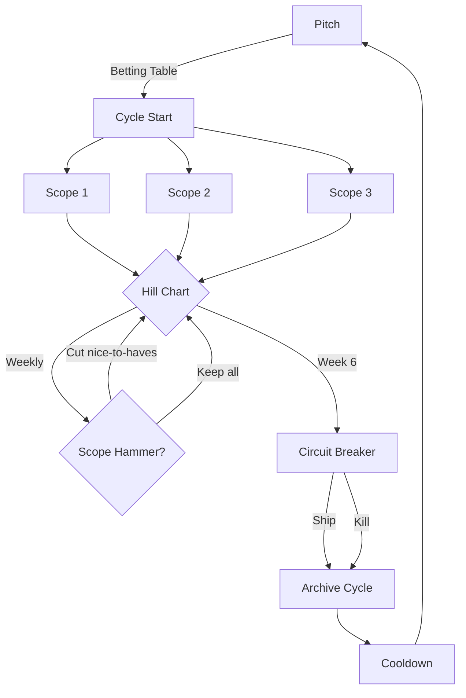
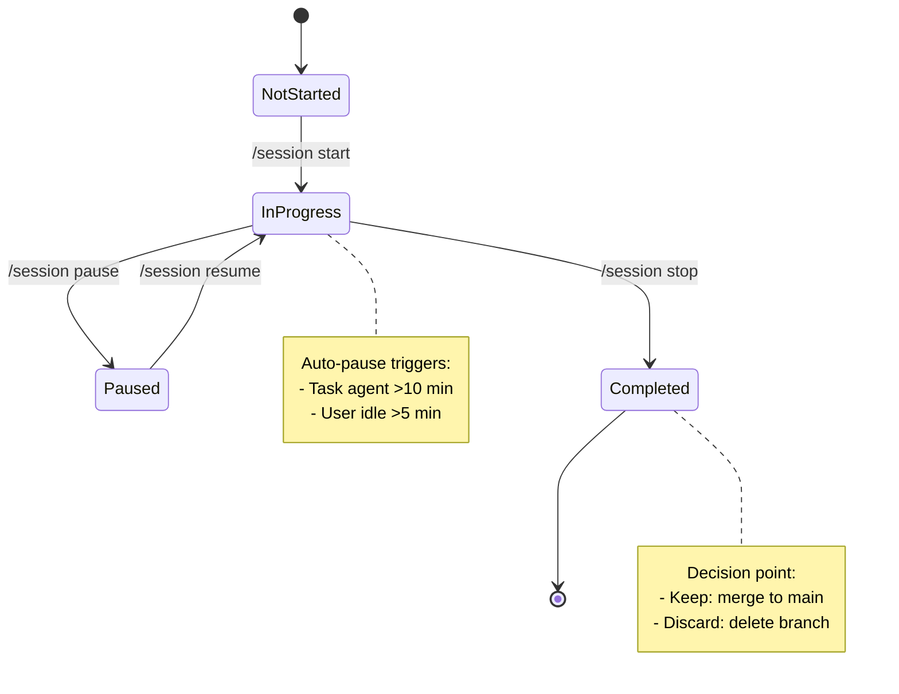

# Shape Up and Session Management

**Audience**: Contributors wanting to understand WHY we use this development methodology

**Type**: Explanation (understanding-oriented)

This document explains the integrated development methodology used by Uberman, combining Shape Up planning with automatic session management.

---

## 1. Introduction

### What is This Methodology?

Uberman uses a dual-layer development methodology:

1. **Shape Up** (planning layer) - Fixed-time cycles with variable scope
2. **Session Management** (execution layer) - Automatic time tracking with health-first enforcement

These layers work together to create sustainable, predictable software development:

- **Shape Up** provides structure for WHAT to build and WHEN to decide
- **Sessions** provide structure for HOW to work and WHEN to rest

### Key Characteristics

**Shape Up Layer**:
- 6-week cycles (big batch) or 1-2 weeks (small batch)
- No backlogs, no sprint planning, no story points
- Hill charts track progress (uphill = figuring out, downhill = executing)
- Circuit breaker kills projects that don't ship in one cycle
- 2-week cooldown between cycles for recovery and shaping

**Session Layer**:
- Automatic time tracking (working vs paused time)
- Progressive break reminders (40 min, 60 min, 90 min hard timeout)
- Session branches for psychological safety (freedom to fail)
- Keep or discard decisions (learning from failed experiments)
- Git commit history as session log

### Integration Points

The two layers connect at specific touchpoints:

1. **Cycle files** track session metrics (total time, sessions per scope)
2. **Session commits** reference cycle and scope context
3. **Hill charts** update weekly based on session discoveries
4. **Circuit breaker** decisions informed by session velocity
5. **Scope hammer** triggered by session struggles (uphill too long)

---

## 2. Philosophy

### Why Shape Up for a Solo Developer?

Shape Up was designed for product teams at Basecamp, but its principles apply powerfully to solo development:

#### Fixed Time, Variable Scope

**Traditional approach** (Scrum, Kanban):
- Estimate story points
- Commit to fixed features
- Extend timeline when estimates wrong
- Result: Chronic deadline slipping, scope creep

**Shape Up approach**:
- Set time budget (appetite)
- Design solution to fit time
- Cut features aggressively (scope hammer)
- Result: Predictable shipping, forced prioritization

**For solo developer**: You can't negotiate with yourself for more time. Fixed time forces honesty about what's achievable.

#### No Backlogs

**Traditional approach**:
- Maintain groomed backlog
- Prioritize hundreds of stories
- Backlog becomes guilt list
- Result: Overwhelm, analysis paralysis

**Shape Up approach**:
- Ideas captured in IDEAS.md (unstructured)
- No prioritization until betting table
- Most ideas never implemented
- Result: Mental clarity, focus on current cycle

**For solo developer**: You don't need to coordinate with a team. Ideas that matter resurface naturally. Let most ideas die.

#### Circuit Breaker

**Traditional approach**:
- Projects drag on for months
- "Just one more sprint"
- Sunk cost fallacy wins
- Result: Never-ending projects, no learning

**Shape Up approach**:
- Hard deadline at end of cycle
- Ship partial or kill project
- No extensions by default
- Result: Fast feedback, learning from failures

**For solo developer**: You're accountable only to yourself. Circuit breaker enforces discipline, prevents rabbit holes.

### Why Session Management?

Shape Up handles planning, but solo developers face execution challenges:

#### The Health Problem

**Without time tracking**:
- Work 3+ hours straight
- Skip breaks
- Burn out
- Result: Unsustainable pace, decreased quality

**With automatic tracking**:
- Gentle reminder at 40 min (target)
- Warning at 60 min (50% over)
- Hard timeout at 90 min (forced break)
- Result: Sustainable pace, maintained quality

#### The Honesty Problem

**Manual time tracking**:
- Forget to start timer
- Forget to stop timer
- Count research as "work"
- Result: Inflated estimates, false velocity

**Automatic tracking**:
- Starts with `/session start`
- Auto-pauses for Task agents >10 min
- Auto-pauses for user idle >5 min
- Result: Accurate data, honest velocity

#### The Learning Problem

**Without session branches**:
- Fear of experimenting (might break main)
- Commit bad code to avoid losing it
- No record of failed approaches
- Result: Conservative development, repeated mistakes

**With session branches**:
- Branch per session (freedom to fail)
- Keep or discard decision at end
- Failed experiments recorded in cycle file
- Result: Bold experimentation, captured learnings

---

## 3. Core Principles

### Fixed Time, Variable Scope

**Definition**: Set the time budget first, then design a solution that fits.

**NOT**: Estimate how long features will take, then add up the time.

**In Practice**:
- Big batch = 6 weeks (major features, large refactorings)
- Small batch = 1-2 weeks (tweaks, bug fixes, small features)
- Appetite set during shaping, before detailed design
- Solution shaped to fit appetite (not the reverse)

**Consequences**:
- Features get cut (scope hammer)
- "Good enough" beats "perfect"
- Shipping becomes predictable
- Creative constraint forces innovation

### No Backlogs

**Definition**: Don't maintain a prioritized list of future work.

**Instead**:
- Capture ideas in IDEAS.md (rough notes)
- Let ideas resurface naturally
- Decide what to build during cooldown (betting table)
- Most ideas never get implemented (intentional)

**Why?**:
- Backlog maintenance is work (YAGNI)
- Priorities change constantly
- Old ideas become stale
- "Important" work makes itself known repeatedly

**Exceptions**:
- Critical bugs (fix immediately in cooldown)
- Security issues (fix immediately)

### Appetite Over Estimates

**Definition**: Declare how much time you're willing to spend, not how long you think it will take.

**Traditional estimation**:
1. Design solution
2. Break into tasks
3. Estimate each task
4. Sum estimates = timeline
5. Problem: Usually wrong

**Appetite-driven**:
1. Set time budget (appetite)
2. Design solution that fits
3. Start building
4. Scope hammer to stay within time
5. Circuit breaker at deadline

**Benefits**:
- Estimation waste eliminated
- Design constrained early (prevents gold-plating)
- Time becomes creative constraint
- Shipping happens on schedule

### Circuit Breaker

**Definition**: Hard deadline at end of cycle. Ship partial, kill project, or extend (rare).

**Default behavior**: No extensions.

**Options at deadline**:

1. **Ship Partial** (most common):
   - Package what works
   - Update documentation
   - Record unfinished scopes in archive
   - Enter cooldown

2. **Kill Project**:
   - Discard all work
   - Record learnings in archive
   - Enter cooldown
   - No shame (fast feedback is valuable)

3. **Extend** (RARE):
   - Only if work is downhill
   - Only if 90% complete
   - Only if extension is 1 week max
   - Document why extension needed

**Why this works**:
- Prevents sunk cost fallacy
- Forces scope hammer during cycle
- Creates safe-to-fail environment
- Builds fast feedback loop

### Scope Hammer

**Definition**: Forcefully question every feature to fit the time box.

**When to use**:
- **During shaping** (primary): Before cycle starts
- **During building**: When scope stuck uphill >2 weeks
- **Week 5 of cycle**: Pre-circuit breaker assessment

**Process**:
1. Identify what's consuming time
2. Question: Must-have or nice-to-have?
3. Cut nice-to-haves entirely
4. Simplify must-haves (good enough > perfect)
5. Record cut in Scope Hammer Log
6. Continue with reduced scope

**Examples**:
- Cut Application Layer (CLI calls domain directly)
- Simplify validation (basic checks instead of property-based)
- Drop dry-run mode (focus on filesystem adapter only)
- Remove UI polish (working > beautiful)

**Mindset**: You're not "giving up" — you're prioritizing shipping.

### No Backlogs (Revisited)

**What about important features we cut?**

If truly important, they'll resurface in cooldown:
- User complaints make problems visible
- Daily use reveals pain points
- Team discussions bring up blockers

**If they don't resurface?**
- They weren't important
- Problem solved by workaround
- Appetite too small (reshape next time)

**Trust the process**: Important work makes itself known.

---

## 4. Shape Up Components

### Cycles

**Definition**: Fixed time-box for completing shaped work.

**Sizes**:
- **Big batch**: 6 weeks (major features, architecture changes)
- **Small batch**: 1-2 weeks (bug fixes, small features)

**Structure**:
- Week 1-2: Uphill work (figuring out unknowns)
- Week 3-4: Transition (moving to execution)
- Week 5-6: Downhill work (executing known solution)

**Only one active cycle** at a time. No juggling multiple initiatives.

**Cycle Structure**:



### Cooldown

**Definition**: 2-week recovery period between cycles.

**Activities**:
- Bug fixes (critical issues from previous cycle)
- Exploration (spike unfamiliar technologies)
- Shaping (write pitches for next cycle)
- Betting table (decide what to build next)

**NOT for**:
- Starting new features
- Continuing incomplete cycle work (unless shipped partial)

**Purpose**: Mental recovery, reflection, strategic thinking.

### Pitches

**Definition**: Shaped work ready for betting.

**Structure** (from Shape Up book):
1. **Problem**: What user pain are we solving?
2. **Appetite**: How much time are we willing to spend?
3. **Solution**: Breadboard sketches, not detailed specs
4. **Rabbit Holes**: Known risks to avoid
5. **No-Gos**: Explicitly out of scope

**Shaping happens during cooldown**, not during cycle.

**Output**: Markdown file in `plans/pitches/`

**Example**: `plans/pitches/2025-11-03-rebuild-install-clean-architecture.md`

### Scopes

**Definition**: Integrated slices of the project, NOT isolated tasks.

**Key insight**: Scopes are interconnected parts of the solution, not a to-do list.

**Typical cycle has 3-5 scopes**:
- Each scope is testable independently
- Each scope contributes to shipping the feature
- Scopes can be worked in any order
- Unfinished scopes can be cut (scope hammer)

**Example scopes** (from current pitch):
1. Domain Layer Foundation (value objects, aggregates)
2. In-Memory Adapter (tests without I/O)
3. Filesystem Adapter (production implementation)
4. Application Layer (use cases)
5. CLI Wiring (command handler)

**NOT scopes**:
- "Write tests" (testing is part of every scope)
- "Documentation" (docs written as you build)
- "Refactoring" (refactor within each scope)

### Hill Charts

**Definition**: Visual representation of progress showing figuring-out vs execution.

**Two phases**:
- **Uphill**: Figuring out unknowns, solving hard problems
- **Downhill**: Executing known solution, implementing details

**The Crest**: Transition point where unknowns become knowns.

**ASCII representation** (used in cycle files):
```
      /\
     /  \____
    /        \____
Uphill      Downhill

Scope1:  ●  (moving toward crest - learning validation patterns)
Scope2:      ● (downhill - implementing known design)
Scope3: ○ (not started)
```

**Update frequency**: Weekly (Friday afternoon ritual)

**Warning signs**:
- Scope stuck uphill >2 weeks = trouble
- All scopes uphill in week 5 = circuit breaker imminent
- Scope moving backward = assumptions were wrong

**What to do**:
- Stuck uphill? Scope hammer or get help
- All uphill late? Prepare to ship partial or kill
- Moving backward? Re-assess approach

### Circuit Breaker

**Definition**: Hard deadline enforcement at end of cycle.

**When**: Last day of cycle (e.g., Friday of week 6)

**Decision framework**:

```
Is the work done?
├─ Yes → Ship (celebrate, archive, cooldown)
├─ No → Are must-haves working?
│   ├─ Yes → Ship partial (cut nice-to-haves, ship what works)
│   └─ No → Is work downhill and 90% complete?
│       ├─ Yes → Extend 1 week (RARE - document why)
│       └─ No → Kill (archive learnings, cooldown)
```

**Ship partial** (most common):
- Package working features
- Update docs for what shipped
- Record unfinished work in archive
- No shame, celebrate learning

**Kill project**:
- Document why it failed
- Capture learnings in archive
- Delete working branches
- No shame, fast feedback is valuable

**Extend** (rare):
- Only if all must-haves work
- Only if < 10% remains
- Only if extension ≤ 1 week
- Document why extension was needed

**After circuit breaker**: Always enter cooldown (2 weeks).

### Betting Table

**Definition**: Decision point during cooldown where you choose what to build next.

**For solo developer**: Self-reflection process.

**Questions to ask**:
1. Is the problem important right now?
2. Is the solution shaped well enough?
3. Is the appetite reasonable?
4. Are we willing to use circuit breaker if needed?
5. Do we have the skills/tools required?

**Output**: Decision documented in `plans/cooldown/YYYY-MM-DD-betting-table.md`

**Options**:
- **Bet**: Commit to cycle (create cycle file, start building)
- **Don't bet**: Put pitch aside, reshape or discard
- **Reshape**: Appetite wrong or solution unclear

**Commitment**: Once you bet, you commit to the circuit breaker.

---

## 5. Session Management

### Automatic Time Tracking

**Traditional approach**:
- Manual timer (forget to start/stop)
- Stopwatch app (requires discipline)
- Honor system (easy to lie to yourself)

**Automatic approach**:
- `/session start <task>` initializes tracking
- Every message updates working time
- Auto-pauses for non-working time
- `/session stop` prompts keep/discard

**What gets tracked**:
- **Working time**: Active conversation with Claude Code
- **Paused time**: Task agents >10 min, user idle >5 min, manual breaks

**What doesn't count as working**:
- Task agent research (auto-paused after 10 min)
- Reading documentation (user idle >5 min triggers pause)
- Manual breaks (`/session pause`)
- Time between sessions

**Result**: Honest data about actual working time, not wall clock time.

### Session Lifecycle



**States**:
- **NotStarted**: No active session
- **InProgress**: Working, timer running, auto-pause monitoring active
- **Paused**: Timer stopped, waiting for resume
- **Completed**: Session ended, branch kept or discarded

**Transitions**:
- `/session start` → IN_PROGRESS (creates branch, starts timer)
- Auto-pause → PAUSED (Task agent or idle detection)
- `/session pause` → PAUSED (manual break)
- `/session resume` → IN_PROGRESS (resumes timer)
- `/session stop` → COMPLETED (prompts keep/discard)

### Health-First Protocol

**Target**: 40-minute sessions with 10-minute breaks.

**Progressive reminders**:

1. **40 minutes**: Gentle reminder
   - "You've been working for 40 minutes (target reached). Consider wrapping up."
   - Action: Continue or stop (your choice)

2. **60 minutes**: Warning
   - "You've been working for 60 minutes (50% over target). Strongly consider stopping."
   - Action: Continue or stop (your choice, but warned)

3. **90 minutes**: Hard timeout
   - "You've been working for 90 minutes. Session paused automatically. Please take a break."
   - Action: Session paused, must resume to continue

**Why these thresholds?**
- **40 min**: Pomodoro-based, sustainable focus duration
- **60 min**: Acceptable stretch, but quality declining
- **90 min**: Cognitive performance significantly degraded

**Enforcement**:
- 40 min, 60 min: Reminders only (optional)
- 90 min: Hard timeout (required break)

### Auto-Pause Logic

**Purpose**: Don't count non-working time as working time.

**Triggers**:

1. **Task Agent Running >10 min**:
   - Agent doing research/exploration
   - User not actively working
   - Auto-pause: `AUTO_TASK`
   - Reason: "Task agent running"

2. **User Idle >5 min**:
   - No messages from user
   - Likely reading docs, taking break, distracted
   - Auto-pause: `AUTO_IDLE`
   - Reason: "User idle"

3. **Manual Break**:
   - `/session pause [reason]`
   - User explicitly stepping away
   - Auto-pause: `MANUAL`
   - Reason: User-provided or "Manual break"

**Resume**:
- Next user message auto-resumes from `AUTO_*` pauses
- `/session resume` resumes from `MANUAL` pause

**Recording**:
- All pauses recorded in session state
- Pause durations calculated
- Total paused time tracked separately

**Result**: Session metrics reflect actual working time, not wall clock.

### Session Branches

**Purpose**: Psychological safety to experiment without fear.

**Convention**: `session/YYYYMMDD-scope-task`

**Example**: `session/20251104-domain-databasename`

**Workflow**:

1. **Start**: `/session start domain-databasename`
   - Creates branch from main
   - Initializes session state
   - Starts timer

2. **Work**: TDD cycles, experiments, iteration
   - Commit freely (won't pollute main)
   - Try risky refactorings
   - Explore alternatives

3. **Stop**: `/session stop`
   - Prompts: Keep or discard?
   - **Keep**: Squash merge to main, commit with metadata
   - **Discard**: Delete branch, record learning in cycle file

**Why this works**:
- Freedom to fail (branch can be thrown away)
- Bold experimentation (no fear of breaking main)
- Learning captured (discarded sessions recorded)
- Main branch stays clean (only merged work)

**Naming benefits**:
- Date visible (stale branches obvious)
- Scope visible (connects to hill chart)
- Task visible (what was attempted)

### Keep or Discard Decisions

**At end of each session**, decide:

**Keep** (merge to main):
- Tests pass
- Code quality acceptable
- Moves scope forward
- Aligns with architecture

**Discard** (delete branch):
- Approach didn't work
- Tests brittle or failing
- Solution too complex
- Dead end discovered

**Recording discarded sessions**:
```markdown
## Session Metrics

**Recent sessions**:
1. 20251104-domain-databasename: 38 min - kept (value object created)
2. 20251104-domain-state-machine: 42 min - discarded (too complex, procedural better)
```

**Learning capture**: Why was it discarded? What did we learn?

**No shame in discarding**: Fast feedback is valuable. Failed experiments teach us what NOT to do.

### Session Metrics

**Tracked automatically**:
- Working time (excludes pauses)
- Paused time (auto + manual)
- Total time (wall clock)
- Sessions kept vs discarded
- Sessions >60 min (warnings)

**Recorded in cycle file**:
```markdown
## Session Metrics

### Week 1 (2025-11-04 to 2025-11-08)
- **Sessions completed**: 5
- **Total working time**: 3.2 hours
- **Avg session**: 38 min (target: 40)
- **Sessions >60 min**: 0 ✓
- **Sessions discarded**: 1
```

**Why track?**:
- Honest velocity measurement
- Health enforcement (catching >60 min sessions)
- Learning rate (kept vs discarded ratio)
- Cycle progress (total time per scope)

**Used for**:
- Hill chart updates (if scope taking too long, still uphill)
- Circuit breaker decisions (velocity informs ship/kill)
- Scope hammer triggers (time exceeding appetite)

---

## What's Next?

This document covered sections 1-5 (introduction through session management). The next sections will cover:

6. **Integration** - How planning and execution unite
7. **Comparison** - vs Scrum, vs Kanban, vs ad-hoc
8. **Benefits** - What you gain from this system
9. **Trade-offs** - What you give up
10. **References** - Basecamp's Shape Up book

**Continue reading**: These sections will be added in the next phase of documentation.

**Start using**: See the practical guides in `how-to/` for step-by-step workflows.
