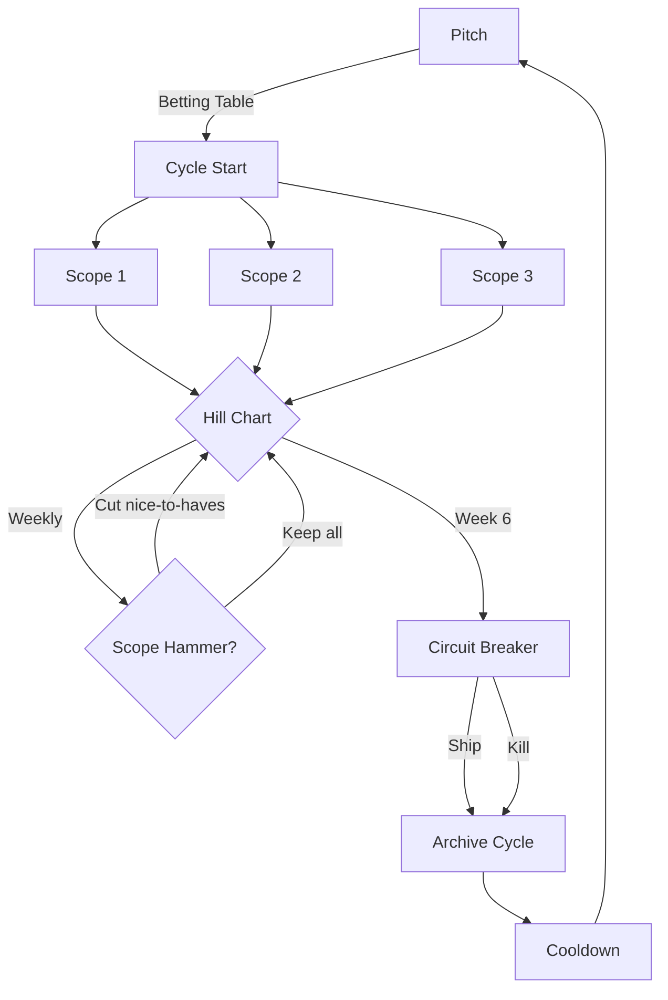

# How To: Plan a Cycle

**Audience**: Developer ready to start a new cycle

**Type**: How-to guide (task-oriented)

This guide walks you through planning a complete cycle from shaping a pitch to starting work.

---

## Prerequisites

- Currently in cooldown (2 weeks after previous cycle)
- Have an idea worth shaping (from IDEAS.md or new insight)
- Understand Shape Up basics (see [explanation](../explanation/shape-up-and-sessions.md))

---

## Step 1: Start in Cooldown

**When**: After previous cycle ends (circuit breaker triggered)

**Activities**:
- Week 1: Bug fixes, recovery, exploration
- Week 2: Shaping pitches, betting table

**Don't start shaping too early**: Use week 1 for mental recovery.

**Example timeline**:
```
Cycle 01: Nov 4 - Dec 15 (6 weeks)
Circuit breaker: Dec 15 (shipped partial)
Cooldown: Dec 16 - Dec 29 (2 weeks)
  Week 1 (Dec 16-22): Bug fixes, recovery
  Week 2 (Dec 23-29): Shaping Cycle 02 pitch
Betting table: Dec 29
Cycle 02: Dec 30 - Feb 9 (6 weeks)
```

---

## Step 2: Shape a Pitch

**When**: Cooldown week 2

**Time investment**: 2-4 hours (spread across several days)

### Pitch Structure (from Shape Up)

**Required sections**:
1. **Problem** - What user pain are we solving?
2. **Appetite** - How much time are we willing to spend?
3. **Solution** - Breadboard sketches (not detailed specs)
4. **Rabbit Holes** - Known risks to avoid
5. **No-Gos** - Explicitly out of scope

### 2.1 Define the Problem

**Question**: What user pain are we solving?

**NOT**: "We need feature X"
**INSTEAD**: "Users struggle with Y because Z"

**Good problem statement**:
```markdown
## Problem

Installing apps on Uberspace is time-consuming and error-prone.
Users must:
1. Research installation steps (scattered across Lab guides)
2. Execute 10-15 manual commands
3. Debug errors without clear feedback
4. Repeat process for every app

Result: 30-60 minutes per app, frequent mistakes, abandoned installs.
```

**Bad problem statement**:
```markdown
## Problem

We need a CLI tool to install apps.
```

**Why bad?**: Describes solution, not problem.

### 2.2 Set the Appetite

**Question**: How much time are we willing to spend?

**Options**:
- **Small batch**: 1-2 weeks (bug fix, small feature, tweak)
- **Big batch**: 6 weeks (major feature, architecture change)

**NOT an estimate**: Appetite is creative constraint, not prediction.

**How to choose**:
- How important is this problem?
- How novel is the solution (unknown unknowns)?
- How much complexity can we handle?

**Example**:
```markdown
## Appetite

**6 weeks** (big batch)

Why:
- Clean Architecture is major refactoring
- Lots of unknowns (TDD, DDD, property-based testing)
- Willing to commit significant time to prove approach
- Can ship partial (domain only) if other layers don't work
```

**Small batch example**:
```markdown
## Appetite

**1 week** (small batch)

Why:
- Fix Docker testcontainers flakiness
- Well-understood problem
- Low risk, incremental improvement
```

### 2.3 Breadboard the Solution

**Question**: What's the rough solution?

**NOT**: Detailed specs, user stories, task breakdowns
**INSTEAD**: High-level components, data flow, user actions

**Breadboarding** (from Shape Up):
- Places: UI screens, backend services, external systems
- Affordances: User actions, buttons, forms
- Connection lines: Data flow

**Example (text breadboard)**:
```markdown
## Solution

### High-Level Approach

Rebuild install command using Clean Architecture:

**Layers**:
1. Domain (pure, no I/O): Installation workflow, validation
2. Application (orchestration): Use cases
3. Infrastructure (adapters): Filesystem, in-memory (tests)
4. CLI (UI): Command handler

**Data Flow**:
```
User: uberman install wordpress ~/apps/blog
  ↓
CLI parses command
  ↓
Application: InstallApp use case
  ↓
Domain: Installation aggregate validates
  ↓
Infrastructure: Filesystem adapter provisions
  ↓
CLI: Success message
```

**Key insight**: Domain models installation as workflow, not data structure.

**Scope**: MVP = Domain + In-Memory (prove pattern works)
```

**Fat marker sketches** (optional):
- Hand-drawn diagrams (low fidelity)
- Forces focus on concepts, not pixels
- Can use ASCII art or simple Mermaid

### 2.4 Call Out Rabbit Holes

**Question**: What could derail this project?

**Rabbit holes**: Known risks that could consume unlimited time.

**Examples**:
```markdown
## Rabbit Holes

1. **Perfect state machine**: Could spend weeks modeling Installation
   as formal state machine. **Instead**: Procedural approach, good enough.

2. **100% test coverage**: Could chase edge cases forever.
   **Instead**: Cover happy path + critical errors, property-based for core.

3. **All Uberspace commands**: Could implement web, database, supervisor.
   **Instead**: Focus on directory creation + manifest parsing only.

4. **Backwards compatibility**: Could support existing config format.
   **Instead**: Fresh start, new format. Migration tool = future cycle.
```

**How to identify**:
- Have you tried this before and gotten stuck?
- Does this involve learning entirely new technology?
- Could this expand infinitely (e.g., "make it perfect")?

**Document to avoid**: When stuck during cycle, refer back.

### 2.5 Define No-Gos

**Question**: What's explicitly out of scope?

**No-gos**: Features you're NOT building in this cycle.

**Examples**:
```markdown
## No-Gos

- **Upgrade command**: Only install for this cycle
- **Uninstall command**: Not in scope
- **Custom app manifests**: Use official Lab apps only
- **Web backend**: CLI only, no server component
- **Windows support**: Linux/macOS only
- **Plugin system**: Hardcoded app list
```

**Why document?**:
- Prevents scope creep during cycle
- Makes trade-offs explicit
- Can revisit in future cycles

### 2.6 Write the Pitch

**Template location**: `plans/templates/pitch-template.md`

**Output location**: `plans/pitches/YYYY-MM-DD-title.md`

**Example filename**: `plans/pitches/2025-11-03-rebuild-install-clean-architecture.md`

**Template**:
```markdown
# Pitch: [Title]

**Date**: YYYY-MM-DD
**Status**: DRAFTED | BET | NOT_BET
**Appetite**: [1-2 weeks | 6 weeks]

## Problem

[User pain description - 2-3 paragraphs]

## Appetite

**[Time budget]**

Why:
- [Reason 1]
- [Reason 2]

## Solution

### High-Level Approach

[Breadboard description]

### Key Insights

- [Insight 1]
- [Insight 2]

## Rabbit Holes

1. **[Rabbit hole 1]**: [Description]. **Instead**: [Mitigation].
2. **[Rabbit hole 2]**: [Description]. **Instead**: [Mitigation].

## No-Gos

- **[Feature 1]**: [Why out of scope]
- **[Feature 2]**: [Why out of scope]

## Out of Bounds

[Technical constraints, platform limitations]

## Next Steps

If bet:
1. Create cycle file (plans/cycles/cycle-NN.md)
2. Define scopes (3-5 integrated slices)
3. Initialize hill chart
4. Start first session
```

**Commit the pitch**:
```bash
git add plans/pitches/2025-11-03-rebuild-install-clean-architecture.md
git commit -m "feat(planning): add pitch for Clean Architecture refactoring"
```

---

## Step 3: Betting Table Decision

**When**: End of cooldown week 2

**Duration**: 30-60 minutes (solo reflection)

**For solo developer**: Self-reflection process, not meeting.

### Betting Table Questions

Ask yourself:

1. **Is the problem important right now?**
   - Pain level: How much does this hurt?
   - Frequency: How often does this problem occur?
   - Impact: What's the cost of NOT fixing this?

2. **Is the solution shaped well enough?**
   - Clear problem statement?
   - Breadboard shows rough approach?
   - Rabbit holes identified?
   - No-gos explicit?

3. **Is the appetite reasonable?**
   - Can I commit this time?
   - Other priorities conflict?
   - Willing to use circuit breaker if stuck?

4. **Do I have the skills/tools?**
   - Technologies familiar enough?
   - Unknowns manageable?
   - Can learn during cycle?

5. **Am I willing to ship partial or kill?**
   - If only 50% done, ship what works?
   - If core assumption wrong, kill project?
   - Circuit breaker commitment real?

### Decision Options

**Option A: Bet** (commit to cycle)
- Create cycle file
- Define scopes
- Initialize hill chart
- Start building

**Option B: Don't Bet** (postpone or discard)
- Problem not important enough
- Solution not shaped well
- Wrong time (other priorities)
- Put pitch aside or discard

**Option C: Reshape** (modify pitch)
- Appetite wrong (too big or too small)
- Solution unclear
- Rabbit holes missed
- Return to shaping

### Document Decision

**Location**: `plans/cooldown/YYYY-MM-DD-betting-table.md`

**Template**:
```markdown
# Betting Table: [Date]

## Pitches Reviewed

### Pitch: [Title]
- **Problem importance**: [High/Medium/Low]
- **Solution clarity**: [Clear/Needs work]
- **Appetite reasonable**: [Yes/No - why]
- **Skills available**: [Yes/No - what's missing]
- **Circuit breaker commitment**: [Yes/No]

**Decision**: BET | DON'T BET | RESHAPE

**Reasoning**:
[2-3 sentences explaining decision]

## Next Cycle

**Cycle NN**: [Name]
**Dates**: [Start] to [End] (N weeks)
**Pitch**: ../pitches/YYYY-MM-DD-title.md
```

**Commit decision**:
```bash
git add plans/cooldown/2025-11-03-betting-table.md
git commit -m "docs(planning): betting table decision for Cycle 01"
```

---

## Step 4: Create Cycle File

**When**: Immediately after betting "yes"

**Location**: `plans/cycles/cycle-NN.md`

**Example**: `plans/cycles/cycle-01-clean-architecture.md`

### Cycle File Structure

**Template**: `plans/templates/cycle-template.md`

```markdown
# Cycle NN: [Cycle Name]

**Status**: ACTIVE
**Dates**: YYYY-MM-DD to YYYY-MM-DD (N weeks)
**Pitch**: ../pitches/YYYY-MM-DD-title.md
**Circuit Breaker**: YYYY-MM-DD

## Current Status

**Active Scope**: [None initially]
**Active Session**: [None]
**Last Update**: YYYY-MM-DD HH:MM

## Hill Chart (Week 1: Mon DD - Fri DD)

```
      /\
     /  \____
    /        \____
Uphill      Downhill
```

Scope1:  ○ (not started)
Scope2:  ○ (not started)
Scope3:  ○ (not started)

## Scopes

[Define in Step 5]

## Session Metrics

### Week 1 (YYYY-MM-DD to YYYY-MM-DD)
- **Sessions completed**: 0
- **Total working time**: 0 hours
- **Avg session**: N/A
- **Sessions >60 min**: 0
- **Sessions discarded**: 0

**Recent sessions**:
[None yet]

### All-Time
- **Total sessions**: 0
- **Total working time**: 0 hours
- **Kept**: 0
- **Discarded**: 0

## Scope Hammer Log

[Empty initially]

## Decisions

[Will add ADRs as cycle progresses]

## Archive

After circuit breaker, this file moves to:
`plans/cycles/archive/cycle-NN-NAME-[SHIPPED|KILLED].md`
```

**Commit cycle file**:
```bash
git add plans/cycles/cycle-01-clean-architecture.md
git commit -m "feat(planning): create Cycle 01 for Clean Architecture refactoring"
```

---

## Step 5: Define Scopes

**What are scopes?**: Integrated slices of the project, NOT isolated tasks.

**Key insight**: Scopes are interconnected parts working together, not a to-do list.

**How many?**: 3-5 scopes per cycle (typical)

### Scope Characteristics

**Good scope**:
- ✅ Testable independently
- ✅ Can be worked in any order
- ✅ Contributes to shipping feature
- ✅ Can be cut if needed (scope hammer)

**Bad scope**:
- ❌ "Write tests" (testing is part of every scope)
- ❌ "Documentation" (docs written as you build)
- ❌ "Refactoring" (refactor within each scope)

### Example Scopes (Clean Architecture Refactoring)

```markdown
## Scopes

### 1. Domain Layer Foundation

**Goal**: Create pure domain model with value objects and aggregates.

**Deliverables**:
- Value objects: AppName, DirectoryPath, DatabaseName, Port
- Installation aggregate (workflow model)
- Validation logic (pattern-based)
- Domain events (if needed)
- Tests: Unit tests (pure, <1ms each)

**Hill Position**: ○ Not started
**Next Session**: Create AppName value object
**Open Questions**:
- Model installation as state machine or procedural?
- Use DDD aggregates or simpler approach?
**Blocked**: None

---

### 2. In-Memory Adapter (Testing)

**Goal**: Prove domain pattern works without I/O.

**Deliverables**:
- In-memory repository implementation
- Installation use case tests
- Proves separation of concerns
- Fast test suite (<10ms)

**Hill Position**: ○ Not started
**Next Session**: N/A (blocked by Scope 1)
**Open Questions**:
- How to handle state in memory?
**Blocked**: Needs Domain Layer complete

---

### 3. Filesystem Adapter (Production)

**Goal**: Real filesystem implementation for production.

**Deliverables**:
- Filesystem repository
- Directory creation (~/apps/)
- Integration tests (testcontainers or temp dirs)
- Error handling (permissions, disk space)

**Hill Position**: ○ Not started
**Next Session**: N/A (blocked by Scope 1 & 2)
**Open Questions**:
- Use testcontainers or real temp dirs?
- How to test filesystem errors?
**Blocked**: Needs Domain + In-Memory complete

---

### 4. Application Layer (~) [Nice-to-have]

**Goal**: Use case orchestration layer.

**Deliverables**:
- InstallApp use case
- Command/query separation
- Transaction boundaries

**Hill Position**: ○ Not started
**Next Session**: N/A (low priority)
**Open Questions**:
- Is this layer needed? Can CLI call domain directly?
**Blocked**: None (can be cut via scope hammer)

**Note**: Marked (~) as nice-to-have. May cut if time tight.

---

### 5. CLI Wiring

**Goal**: Wire command handler to use domain + adapters.

**Deliverables**:
- Install command handler
- Dependency injection
- Error formatting
- Success/failure messages

**Hill Position**: ○ Not started
**Next Session**: N/A (blocked by all above)
**Open Questions**:
- Call application layer or domain directly?
**Blocked**: Needs at least Domain + one adapter
```

### Scope Ordering Strategy

**Typical approaches**:

1. **Bottom-up** (used above):
   - Domain → In-Memory → Filesystem → App → CLI
   - Pros: Solid foundation, TDD-friendly
   - Cons: No visible progress early

2. **Top-down**:
   - CLI → App → Infrastructure → Domain
   - Pros: Visible progress early
   - Cons: May violate dependency rules

3. **Risk-first**:
   - Tackle hardest scope first
   - Pros: Early feedback on feasibility
   - Cons: May discard more work

**For Clean Architecture**: Bottom-up ensures dependency rule enforced.

---

## Step 6: Initialize Hill Chart

**Purpose**: Track progress weekly (uphill vs downhill).

**Initial state**: All scopes at "not started" (○)

```markdown
## Hill Chart (Week 1: Nov 4 - Nov 8)

```
      /\
     /  \____
    /        \____
Uphill      Downhill
```

Domain Layer:          ○ (not started)
In-Memory Adapter:     ○ (not started)
Filesystem Adapter:    ○ (not started)
Application Layer (~): ○ (not started)
CLI Wiring:            ○ (not started)
```

**Update frequency**: Friday afternoons (weekly ritual)

**See also**: [How to update hill chart](update-hill-chart.md)

---

## Step 7: Mark First Scope Active

**Choose**: Which scope to work on first?

**For Clean Architecture**: Domain Layer (foundation)

**Update cycle file**:
```markdown
## Current Status

**Active Scope**: Domain Layer Foundation
**Active Session**: None (ready to start)
**Last Update**: 2025-11-04 10:00

## Scopes

### 🎯 1. Domain Layer Foundation (ACTIVE)

**Goal**: Create pure domain model with value objects and aggregates.

**Hill Position**: ○ Not started
**Next Session**: Create AppName value object
**Open Questions**:
- Model installation as state machine or procedural?
**Blocked**: None
```

**Marker**: 🎯 indicates active scope

---

## Step 8: Start Cycle

**Final commit**:
```bash
git add plans/cycles/cycle-01-clean-architecture.md
git commit -m "feat(planning): define scopes and initialize hill chart for Cycle 01"
```

**Announce start** (optional):
```bash
echo "Cycle 01 started: Clean Architecture Refactoring"
echo "Circuit breaker: 2025-12-15 (6 weeks)"
echo "Next session: Create AppName value object"
```

**You're ready to work!**

Next: [How to run a session](run-a-session.md)

---

## Cycle Structure Diagram



---

## Common Pitfalls

### ❌ Pitfall 1: Too Many Scopes

**Symptom**: 8-10 scopes defined

**Problem**: Can't finish in 6 weeks, no focus

**Fix**: Combine related scopes, cut nice-to-haves

**Rule of thumb**: 3-5 scopes (typical)

### ❌ Pitfall 2: Scopes Are Tasks

**Symptom**: Scopes like "Write tests", "Add docs"

**Problem**: Not integrated slices, can't ship partial

**Fix**: Each scope is vertical slice (domain → infrastructure → CLI)

### ❌ Pitfall 3: No Nice-to-Haves Marked

**Symptom**: All scopes marked must-have

**Problem**: No room for scope hammer

**Fix**: Mark 1-2 scopes with (~), willing to cut

### ❌ Pitfall 4: Unclear Next Session

**Symptom**: "Next Session: Work on domain"

**Problem**: Too vague, hard to start

**Fix**: Concrete task, e.g., "Create AppName value object"

### ❌ Pitfall 5: Skipping Betting Table

**Symptom**: Pitch written, cycle started immediately

**Problem**: No reflection, may regret bet

**Fix**: Sleep on pitch, review next day, formal decision

---

## Summary Checklist

Before starting cycle, ensure:

- [ ] Cooldown complete (2 weeks)
- [ ] Pitch written (problem, appetite, solution, rabbit holes, no-gos)
- [ ] Betting table decision (bet yes)
- [ ] Cycle file created (cycle-NN.md)
- [ ] Scopes defined (3-5 integrated slices)
- [ ] Nice-to-haves marked (~)
- [ ] Hill chart initialized (all not started)
- [ ] First scope marked active (🎯)
- [ ] Next session defined (concrete task)
- [ ] Circuit breaker date set
- [ ] Committed to git

**You're ready to start working!**

---

## Related Guides

- **Next**: [How to run a session](run-a-session.md)
- **During cycle**: [How to update hill chart](update-hill-chart.md)
- **If stuck**: [How to use scope hammer](scope-hammer.md)
- **At deadline**: [How to handle circuit breaker](circuit-breaker.md)
- **After cycle**: [How to archive cycle](archive-cycle.md)

---

**Last Updated**: 2025-11-04
**Related**: [Explanation](../explanation/shape-up-and-sessions.md), [Reference: Cycle File Format](../reference/cycle-file-format.md)
