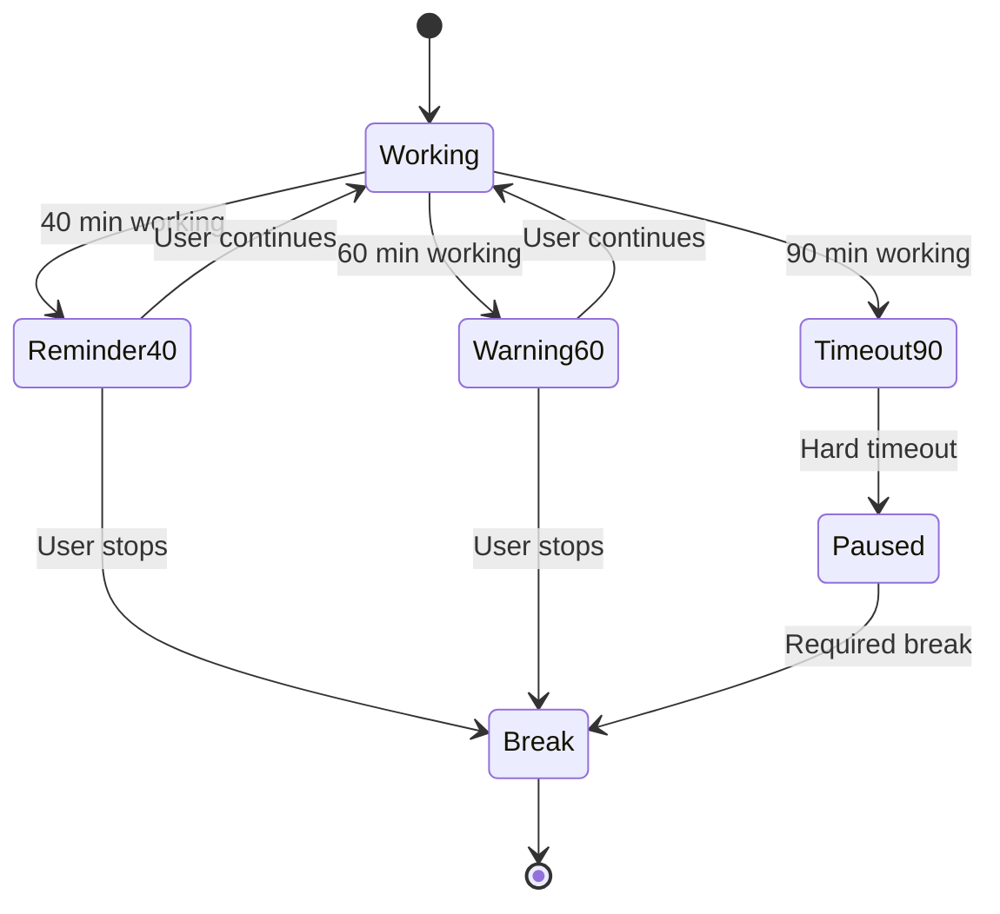
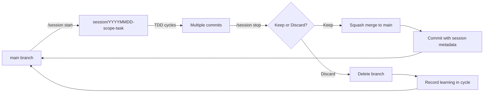

# How To: Run a Session

**Audience**: Developer ready to work on a task

**Type**: How-to guide (task-oriented)

This guide walks you through running a complete session from start to finish, with automatic time tracking and health enforcement.

---

## Prerequisites

- Active cycle with defined scopes
- "Next Session" task identified in cycle file
- Understanding of session management basics (see [explanation](../explanation/shape-up-and-sessions.md))

---

## Session Workflow Overview

```mermaid
graph LR
    A[Check Cycle File] --> B[/session start]
    B --> C[Create Branch]
    C --> D[TDD Cycles]
    D --> E{Continue?}
    E -->|Yes| D
    E -->|Break| F[/session pause]
    F --> G[/session resume]
    G --> D
    E -->|Done| H[/session stop]
    H --> I{Keep or Discard?}
    I -->|Keep| J[Squash Merge]
    I -->|Discard| K[Delete Branch]
    J --> L[Update Cycle]
    K --> L
    L --> M[Take Break]
```

---

## Step 1: Check Cycle File for "Next Session"

**Location**: `plans/cycles/cycle-NN.md`

**Find**:
```markdown
## Scopes

### 🎯 1. Domain Layer Foundation (ACTIVE)

**Goal**: Create pure domain model with value objects and aggregates.

**Hill Position**: ● Uphill (learning validation patterns)
**Next Session**: Create AppName value object
**Open Questions**:
- Validation pattern: regex or manual checks?
**Blocked**: None
```

**Task identified**: "Create AppName value object"

**If unclear**: Refine "Next Session" before starting (make it concrete).

---

## Step 2: Start Session

**Command**: `/session start <task>`

**Format**: Short, hyphenated task name (matches branch naming)

**Example**:
```
/session start domain-appname
```

**What happens**:
1. Creates branch: `session/20251104-domain-appname`
2. Initializes session state (`.claude/session-state.json`)
3. Starts timer
4. Updates cycle file with active session
5. Confirms to user

**Output** (from Claude):
```
Session started: domain-appname
Branch: session/20251104-domain-appname
Scope: Domain Layer Foundation
Timer: Started (target 40 min)

Auto-pause monitoring active:
- Task agents >10 min
- User idle >5 min

Break reminders:
- 40 min: Gentle reminder
- 60 min: Warning
- 90 min: Hard timeout

Ready to work. Start with a failing test!
```

---

## Step 3: Work in TDD Cycles

**TDD workflow**: Red → Green → Refactor

### 3.1 Write Failing Test

**Example**:
```go
// internal/appinstallation/domain/valueobjects/appname_test.go
package valueobjects_test

import (
    "testing"
    "github.com/yourusername/uberman/internal/appinstallation/domain/valueobjects"
)

func TestAppName_Valid(t *testing.T) {
    // Arrange
    input := "wordpress"

    // Act
    appName, err := valueobjects.NewAppName(input)

    // Assert
    if err != nil {
        t.Fatalf("expected no error, got %v", err)
    }
    if appName.String() != "wordpress" {
        t.Errorf("expected 'wordpress', got '%s'", appName.String())
    }
}
```

**Run test** (should fail):
```bash
go test ./internal/appinstallation/domain/valueobjects/...
# FAIL: undefined: NewAppName
```

### 3.2 Make Test Pass

**Implementation**:
```go
// internal/appinstallation/domain/valueobjects/appname.go
package valueobjects

import "errors"

type AppName struct {
    value string
}

func NewAppName(value string) (AppName, error) {
    if value == "" {
        return AppName{}, errors.New("app name cannot be empty")
    }
    return AppName{value: value}, nil
}

func (a AppName) String() string {
    return a.value
}
```

**Run test** (should pass):
```bash
go test ./internal/appinstallation/domain/valueobjects/...
# PASS
```

### 3.3 Refactor

**Add more tests** (edge cases):
```go
func TestAppName_Empty_ReturnsError(t *testing.T) {
    _, err := valueobjects.NewAppName("")
    if err == nil {
        t.Fatal("expected error for empty name")
    }
}

func TestAppName_WithHyphen_Valid(t *testing.T) {
    appName, err := valueobjects.NewAppName("my-app")
    if err != nil {
        t.Fatalf("expected no error, got %v", err)
    }
    if appName.String() != "my-app" {
        t.Errorf("expected 'my-app', got '%s'", appName.String())
    }
}
```

**Enhance validation**:
```go
func NewAppName(value string) (AppName, error) {
    if value == "" {
        return AppName{}, errors.New("app name cannot be empty")
    }
    if len(value) > 50 {
        return AppName{}, errors.New("app name too long (max 50 chars)")
    }
    // Add pattern validation if needed
    return AppName{value: value}, nil
}
```

**Commit** (on session branch):
```bash
git add .
git commit -m "test: add AppName value object with validation"
```

### 3.4 Repeat TDD Cycle

Continue Red → Green → Refactor for full value object:
- Add property-based tests (optional)
- Test validation edge cases
- Refactor for clarity

**Typical session**: 3-5 TDD cycles in 40 minutes

---

## Step 4: Automatic Monitoring

**While you work**, session manager monitors:

### 4.1 Working Time

**Counted as working**:
- Active conversation with Claude Code
- User messages (code requests, questions)
- Short Claude responses (<10 min)

**Example**:
```
14:23 User: "Create AppName value object"
14:24 Claude: [Writes code]
14:25 User: "Add validation for empty string"
14:26 Claude: [Updates code]
...
15:01 User: "Run tests"
15:01 Claude: [Runs tests]

Working time: 38 minutes
```

### 4.2 Auto-Pause for Task Agents

**Trigger**: Task agent running >10 min

**Example**:
```
14:30 User: "Research best validation patterns"
14:31 Claude: Launching Task agent (research)
[Task agent runs for 12 minutes]
14:43 Task agent completes

Auto-pause: 12 minutes (TASK)
Working time: Excludes Task agent time
```

**Rationale**: Research is valuable but not active coding.

### 4.3 Auto-Pause for User Idle

**Trigger**: User idle >5 min (no messages)

**Example**:
```
14:45 User: "What's the best regex pattern?"
14:46 Claude: [Provides answer]
[5 minutes pass, no user response]
14:51 Auto-pause: IDLE

[User returns]
15:05 User: "Let's use this pattern"
Auto-resume
Paused time: 14 minutes
```

**Rationale**: User likely reading docs, taking break, or distracted.

### 4.4 Manual Pause

**Command**: `/session pause [reason]`

**Example**:
```
14:50 User: "/session pause phone call"

Session paused (MANUAL)
Reason: phone call
Working time so far: 27 minutes

Resume with: /session resume
```

**Use when**:
- Taking explicit break
- Stepping away from computer
- Attending meeting

---

## Step 5: Break Reminders

**Progressive reminders** enforce healthy work pace.

### Reminder 1: 40 Minutes (Gentle)

**Message**:
```
⏰ You've been working for 40 minutes (target reached).

Consider wrapping up your current task and stopping for a break.

You can continue if you're in the middle of something, but try to
finish within 10-20 minutes.

Stats:
- Working time: 40 min
- Paused time: 3 min (auto-pauses)
- Total time: 43 min

Next reminder: 60 min
```

**Action**: Your choice
- Continue (if close to finishing)
- Stop (recommended)

### Reminder 2: 60 Minutes (Warning)

**Message**:
```
⚠️ You've been working for 60 minutes (50% over target).

Strongly consider stopping now. Cognitive performance declines after
60 minutes of focused work.

Stats:
- Working time: 60 min
- Paused time: 5 min
- Total time: 65 min

Hard timeout at 90 min (forced break).
```

**Action**: Your choice, but warned
- Stop recommended (quality declining)
- Continue if absolutely necessary

### Reminder 3: 90 Minutes (Hard Timeout)

**Message**:
```
🛑 You've been working for 90 minutes. Session paused automatically.

Please take a break. You cannot continue until you've rested.

Stats:
- Working time: 90 min
- Paused time: 8 min
- Total time: 98 min

Take at least a 10-minute break, then:
- /session resume (continue working)
- /session stop (end session and decide keep/discard)
```

**Action**: REQUIRED break
- Cannot continue without break
- Must type `/session resume` after resting

**Why hard timeout**: Cognitive performance significantly degraded after 90 min.

### Break Reminder Flow



---

## Step 6: Stop Session

**Command**: `/session stop`

**When to use**:
- Task complete (tests passing)
- Reached 40 min (target)
- Stuck (approach not working)
- Break reminder triggered

**What happens**:
1. Timer stops
2. Calculate final metrics
3. Prompt: Keep or discard?

**Output**:
```
Session stopped: domain-appname
Branch: session/20251104-domain-appname
Duration: 38 min working, 4 min paused, 42 min total

Keep or discard this session?

Keep: Squash merge to main, commit with metadata
Discard: Delete branch, record learning in cycle file

Enter: keep | discard
```

---

## Step 7: Keep or Discard Decision

**Critical decision point**: What to do with session work?

### Option A: Keep (Merge to Main)

**When to keep**:
- Tests passing ✓
- Code quality acceptable ✓
- Moves scope forward ✓
- Aligns with architecture ✓

**Example**:
```
User: keep

Keeping session: domain-appname

1. Squash merging to main...
2. Creating commit with metadata...
3. Deleting session branch...
4. Updating cycle file metrics...

Done! Session merged to main.

Commit: feat(domain): create AppName value object

See: git log -1
```

#### 7.1 Squash Merge Process

**Git commands** (automatic):
```bash
# Checkout main
git checkout main

# Squash merge session branch
git merge --squash session/20251104-domain-appname

# Create commit with metadata
git commit -m "$(cat <<'EOF'
feat(domain): create AppName value object

Session: 20251104 14:23-15:01 (38 min actual, 4 min paused)

Created AppName value object with validation:
- Empty string validation
- Length limit (50 chars)
- Pattern-based approach (simpler than regex)

Learned that pattern-based validation is more maintainable than
character-by-character checking.

Cycle: 01 (Clean Architecture)
Scope: Domain Layer Foundation
Hill: Uphill (still learning validation patterns)

🤖 Generated with [Claude Code](https://claude.com/claude-code)
Co-Authored-By: Claude <noreply@anthropic.com>
EOF
)"

# Delete session branch
git branch -D session/20251104-domain-appname
```

**Main branch**: Now has one clean commit with session metadata.

#### 7.2 Update Cycle File

**Add to session metrics**:
```markdown
## Session Metrics

### Week 1 (2025-11-04 to 2025-11-08)
- **Sessions completed**: 1
- **Total working time**: 0.6 hours
- **Avg session**: 38 min (target: 40)
- **Sessions >60 min**: 0 ✓
- **Sessions discarded**: 0

**Recent sessions**:
1. 20251104-domain-appname: 38 min (4 min paused) - **kept** (value object created)
```

**Update "Next Session"**:
```markdown
### 🎯 1. Domain Layer Foundation (ACTIVE)

**Next Session**: Create DirectoryPath value object
```

### Option B: Discard (Delete Branch)

**When to discard**:
- Approach didn't work ✗
- Tests brittle or failing ✗
- Solution too complex ✗
- Dead end discovered ✗

**Example**:
```
User: discard

Discarding session: domain-state-machine

Why discard? (one-line summary)
User: State machine too complex, procedural approach better

Recording learning...

1. Deleting session branch...
2. Updating cycle file with learning...

Done! Session discarded, learning recorded.

No code merged. Approach documented for future reference.
```

#### 7.3 Delete Branch

**Git command** (automatic):
```bash
# Delete session branch (lose all commits)
git branch -D session/20251104-domain-state-machine
```

**Main branch**: Unchanged (nothing merged).

#### 7.4 Record Learning

**Add to cycle file**:
```markdown
## Session Metrics

### Week 1 (2025-11-04 to 2025-11-08)
- **Sessions completed**: 2
- **Total working time**: 1.3 hours
- **Avg session**: 39 min
- **Sessions >60 min**: 0 ✓
- **Sessions discarded**: 1

**Recent sessions**:
1. 20251104-domain-appname: 38 min - kept
2. 20251104-domain-state-machine: 42 min - **discarded** (too complex, procedural better)
```

**Learning captured**: "State machine too complex, procedural better"

**Future benefit**: Won't repeat same mistake.

---

## Step 8: Update Cycle File

**After keep or discard**, update cycle file manually (if not automatic):

### 8.1 Update Session Metrics

**Increment counts**:
```markdown
- **Sessions completed**: 2 (was 1)
- **Total working time**: 1.3 hours (was 0.6)
- **Kept**: 1
- **Discarded**: 1
```

### 8.2 Update "Next Session"

**Plan next task**:
```markdown
**Next Session**: Create DirectoryPath value object
```

### 8.3 Update Hill Chart (if significant progress)

**If scope status changed**:
```markdown
**Hill Position**: ● Moving toward crest (2 value objects complete)
```

**Note**: Full hill chart update happens Friday (weekly ritual), not after every session.

---

## Step 9: Take 10-Minute Break

**REQUIRED**: After every session, take a break.

**Why**:
- Cognitive recovery (restore performance)
- Prevent burnout (sustainable pace)
- Reflect on session (what worked, what didn't)

**Activities**:
- Walk away from computer
- Stretch, walk, drink water
- Don't read technical content

**After break**: Ready for next session (or done for the day).

---

## Session Branch Workflow



---

## Example Sessions

### Example 1: Successful Session (Kept)

**Task**: Create AppName value object

**Timeline**:
```
14:23 /session start domain-appname
14:24 Write failing test (AppName validation)
14:28 Implement AppName struct
14:30 Test passes
14:32 Add edge case tests (empty, too long)
14:38 Refactor validation logic
14:42 Add property-based test (optional)
14:55 All tests passing
15:01 /session stop

Duration: 38 min working, 4 min paused
Decision: keep
```

**Outcome**:
- Tests: 6 passing ✓
- Coverage: 95% ✓
- Code: Clean, maintainable ✓
- Merged to main

### Example 2: Discarded Session (Learned)

**Task**: Explore state machine for Installation workflow

**Timeline**:
```
10:15 /session start domain-state-machine
10:16 Research FSM libraries (Task agent: 12 min)
10:28 Auto-pause: TASK
10:28 Implement state machine (Event, State, Transition)
10:45 Write tests (brittle, lots of mocking)
10:52 Refactor (still complex)
10:57 /session stop

Duration: 30 min working, 12 min paused
Decision: discard
Reason: State machine too complex for this domain
```

**Outcome**:
- Tests: Passing but brittle ✗
- Code: Too many abstractions ✗
- Complexity: Not justified ✗
- Learning: Procedural approach simpler

### Example 3: Auto-Paused for Research

**Task**: Create DatabaseName value object

**Timeline**:
```
16:10 /session start domain-databasename
16:11 "Research MySQL naming rules" (Task agent: 15 min)
16:26 Auto-pause: TASK (15 min)
16:26 Write failing test
16:30 Implement validation
16:35 Tests pass
16:40 Add edge cases
16:48 /session stop

Duration: 32 min working, 15 min paused
Decision: keep
```

**Note**: Task agent time excluded from working time (research ≠ coding).

### Example 4: Break Reminder at 40 Min

**Task**: Create Port value object

**Timeline**:
```
11:00 /session start domain-port
11:01 Write failing test
11:05 Implement Port struct
11:15 Add validation (port range 1024-65535)
11:25 Test edge cases (0, negative, too high)
11:35 Refactor validation logic
11:40 ⏰ Reminder: 40 min reached

User: "Let me finish this edge case"

11:45 Edge case test complete
11:46 /session stop

Duration: 46 min working
Decision: keep
```

**Note**: Continued past 40 min (optional), stopped at 46 min.

### Example 5: Hard Timeout at 90 Min

**Task**: Explore Docker testcontainers

**Timeline**:
```
09:00 /session start infrastructure-docker-tests
09:01 Setup testcontainers
09:20 Debugging container startup issues
09:45 Container starts, but slow (30s per test)
10:15 Trying to optimize startup
10:40 ⏰ Reminder: 40 min reached (ignored)
10:45 Still debugging
11:00 ⚠️ Warning: 60 min reached (ignored)
11:15 Still stuck on startup time
11:30 🛑 Hard timeout: 90 min

Session paused automatically. REQUIRED break.

11:45 /session resume
11:50 /session stop (giving up)

Duration: 95 min working (includes 5 min after resume)
Decision: discard
Reason: Docker testcontainers too complex, real temp dirs simpler
```

**Note**: Hard timeout enforced, 90 min is max without break.

---

## Session Commands Reference

**Start session**:
```
/session start <task>
```

**Stop session**:
```
/session stop
```

**Pause session** (manual):
```
/session pause [reason]
```

**Resume session**:
```
/session resume
```

**Check status**:
```
/session status
```

**See also**: [Reference: Session Commands](../reference/session-commands.md)

---

## Common Pitfalls

### ❌ Pitfall 1: Vague Task Names

**Bad**: `/session start work-on-domain`

**Good**: `/session start domain-appname`

**Why**: Branch name should indicate specific work.

### ❌ Pitfall 2: Ignoring Break Reminders

**Symptom**: Continuing past 60 min regularly

**Problem**: Cognitive performance declines, quality suffers

**Fix**: Respect 40 min target, stop at 60 min max

### ❌ Pitfall 3: Not Recording Discarded Sessions

**Symptom**: Discard session, forget why

**Problem**: Repeat same mistake in future

**Fix**: Always provide reason when discarding

### ❌ Pitfall 4: Keeping Broken Code

**Symptom**: Tests failing, "I'll fix it later"

**Problem**: Main branch broken, damages trust

**Fix**: Discard if tests fail, fix in next session

### ❌ Pitfall 5: Not Taking Breaks

**Symptom**: Back-to-back sessions, no breaks

**Problem**: Burnout, decreased quality

**Fix**: Mandatory 10-minute break after every session

---

## Summary Checklist

Before session:

- [ ] Check cycle file for "Next Session" task
- [ ] Task is concrete (not vague)
- [ ] Ready to start (no blockers)

During session:

- [ ] `/session start <task>` to begin
- [ ] Work in TDD cycles (red → green → refactor)
- [ ] Commit frequently on session branch
- [ ] Respect break reminders (40/60/90 min)
- [ ] `/session pause` if taking manual break
- [ ] `/session resume` to continue

After session:

- [ ] `/session stop` to end
- [ ] Decide: Keep or discard?
- [ ] Update cycle file (metrics, next session)
- [ ] Take 10-minute break

---

## Related Guides

- **Before session**: [How to plan a cycle](plan-a-cycle.md)
- **During cycle**: [How to update hill chart](update-hill-chart.md)
- **If stuck**: [How to use scope hammer](scope-hammer.md)
- **At deadline**: [How to handle circuit breaker](circuit-breaker.md)

---

**Last Updated**: 2025-11-04
**Related**: [Explanation: Session Management](../explanation/shape-up-and-sessions.md#session-management), [Reference: Session Commands](../reference/session-commands.md)
