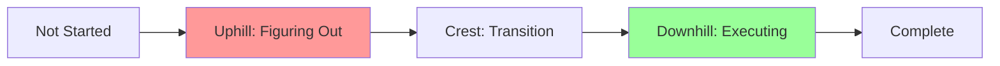

# How To: Update Hill Chart

**Audience**: Developer at end of week reviewing progress

**Type**: How-to guide (task-oriented)

This guide shows you how to update the hill chart during your Friday afternoon ritual.

---

## What is a Hill Chart?

**Definition**: Visual representation showing figuring-out (uphill) vs executing (downhill).

**Two phases**:
- **Uphill**: Unknown unknowns, solving hard problems, exploring solutions
- **Downhill**: Known solution, implementing details, executing

**The Crest**: Transition point where unknowns become knowns.



**ASCII representation** (used in cycle files):
```
      /\
     /  \____
    /        \____
Uphill      Downhill

○ Not started
● On the hill (uphill or downhill)
●● Complete
```

---

## When to Update

**Frequency**: Weekly (Friday afternoon)

**Why Friday**:
- End of week (natural reflection point)
- Before weekend (mental closure)
- Prepares "Next Session" for Monday

**Time required**: 20-30 minutes

**NOT after every session**: Hill chart is weekly, not session-by-session.

---

## Friday Afternoon Ritual

**Steps**:
1. Review week's sessions (from cycle file)
2. Check session metrics (time, discarded count)
3. Assess each scope's progress
4. Update hill chart positions
5. Update scope descriptions (discoveries, blockers)
6. Update "Next Session" for active scope
7. Check for stuck scopes (>2 weeks uphill)
8. Commit hill chart update

---

## Step 1: Review Week's Sessions

**Location**: `plans/cycles/cycle-NN.md`

**Find session metrics**:
```markdown
## Session Metrics

### Week 1 (2025-11-04 to 2025-11-08)
- **Sessions completed**: 5
- **Total working time**: 3.2 hours
- **Avg session**: 38 min (target: 40)
- **Sessions >60 min**: 0 ✓
- **Sessions discarded**: 1

**Recent sessions**:
1. 20251104-domain-appname: 38 min - kept (value object created)
2. 20251104-domain-state-machine: 42 min - discarded (too complex)
3. 20251105-domain-procedural: 36 min - kept (simpler approach)
4. 20251105-domain-directorypath: 40 min - kept (value object)
5. 20251108-domain-databasename: 41 min - kept (value object)
```

**Analysis**:
- 5 sessions completed
- 4 kept, 1 discarded (20% discard = healthy exploration)
- All sessions near 40 min target ✓
- No overwork (0 sessions >60 min) ✓

---

## Step 2: Assess Scope Progress

**For each scope**, ask:

### Question 1: Uphill or Downhill?

**Uphill indicators** (figuring out):
- Discarded sessions (exploring approaches)
- Open questions (still unanswered)
- Tests brittle (approach not solid)
- Frequent refactoring (design unclear)

**Downhill indicators** (executing):
- Sessions kept (approach working)
- Tests passing, stable
- Implementation straightforward
- Velocity increasing

**Example**:
```
Domain Layer Foundation (Week 1):
- 5 sessions (4 kept, 1 discarded)
- Discarded: State machine (too complex)
- Kept: Procedural approach (working)
- Open questions: Still learning validation patterns
- Tests: Passing, but refactoring frequently

Assessment: UPHILL (still exploring validation approaches)
```

### Question 2: How Far Along?

**Uphill positions**:
- `●` Start of uphill (just started figuring out)
- `●` Mid uphill (making progress, still unknowns)
- `●` Near crest (close to understanding solution)

**Downhill positions**:
- `●` Start of downhill (solution known, starting execution)
- `●` Mid downhill (implementation progressing)
- `●●` Complete (done, tests passing)

**Example**:
```
Domain Layer (Week 1):
- 3 value objects complete (AppName, DirectoryPath, DatabaseName)
- Installation aggregate not started
- Validation patterns still evolving

Position: ● Mid uphill (40% toward crest)
```

---

## Step 3: Update Hill Chart

**Template** (in cycle file):
```markdown
## Hill Chart (Week N: Mon DD - Fri DD)

```
      /\
     /  \____
    /        \____
Uphill      Downhill
```

Scope1:  ● (position description)
Scope2:  ○ (not started)
Scope3:      ● (position description)
```

**Update each scope**:
```markdown
## Hill Chart (Week 1: Nov 4 - Nov 8)

```
      /\
     /  \____
    /        \____
Uphill      Downhill
```

Domain Layer:          ● 40% uphill (learning validation patterns)
In-Memory Adapter:     ○ (not started, waiting for domain)
Filesystem Adapter:    ○ (not started)
Application Layer (~): ○ (not started, may cut)
CLI Wiring:            ○ (not started)
```

**Next week** (Week 2):
```markdown
## Hill Chart (Week 2: Nov 11 - Nov 15)

```
      /\
     /  \____
    /        \____
Uphill      Downhill
```

Domain Layer:           ● Downhill (validation solid, implementing aggregates)
In-Memory Adapter:      ● 30% uphill (exploring test patterns)
Filesystem Adapter:     ○ (not started)
Application Layer (~):  ○ (cut - CLI calls domain directly)
CLI Wiring:             ○ (not started)
```

**Movement visible**: Domain moved crest to downhill, In-Memory started.

---

## Step 4: Update Scope Descriptions

**For active scope**, update details:

```markdown
### 🎯 1. Domain Layer Foundation (ACTIVE)

**Goal**: Create pure domain model with value objects and aggregates.

**Hill Position**: ● Downhill (validation solid, implementing aggregates)

**Progress this week**:
- Created 3 value objects (AppName, DirectoryPath, DatabaseName)
- Discarded state machine approach (too complex)
- Adopted procedural workflow (simpler)
- Validation patterns stabilized (pattern-based)

**Next Session**: Create Installation aggregate (procedural workflow)

**Open Questions**:
- ~~Model installation as state machine or procedural?~~ RESOLVED: Procedural
- How to handle validation errors? (exception vs result type)

**Blocked**: None

**Discoveries**:
- Pattern-based validation simpler than regex
- Property-based tests find edge cases early
- TDD with 40-minute sessions sustainable
```

**Key updates**:
- Hill position changed (uphill → downhill)
- Progress section (what happened this week)
- Next Session updated (concrete task)
- Open questions resolved or added
- Discoveries recorded

---

## Step 5: Check for Stuck Scopes

**Warning sign**: Scope stuck uphill >2 weeks

**Example** (Week 3):
```markdown
## Hill Chart (Week 3: Nov 18 - Nov 22)

```
      /\
     /  \____
    /        \____
Uphill      Downhill
```

Domain Layer:       ●● Complete
In-Memory Adapter:  ●● Complete
Filesystem Adapter:  ● Uphill (still exploring Docker testcontainers) ⚠️
CLI Wiring:         ○ (not started)
```

**Problem**: Filesystem stuck uphill for 3 weeks.

**Action**: Trigger scope hammer consideration.

**Decision**:
```markdown
## Scope Hammer Log

- **2025-11-22**: Simplify Filesystem tests (no Docker)
  **Why**: Week 3, scope stuck uphill, Docker testcontainers flaky
  **Impact**: Use real temp dirs (~/.uberman-test/) instead
  **Trade-off**: Tests slower (50ms vs 10ms)
  **Future**: Revisit Docker if tests become bottleneck
```

**Hill chart next week** (after scope hammer):
```markdown
Filesystem Adapter:      ● Downhill (temp dir approach working)
```

**Movement**: Scope hammer unstuck scope, moved to downhill.

---

## Step 6: Update "Next Session"

**For active scope**, define concrete next task:

**Bad** (too vague):
```markdown
**Next Session**: Work on domain
```

**Good** (concrete):
```markdown
**Next Session**: Create Installation aggregate (procedural workflow)
```

**Guidelines**:
- Specific task (not "work on X")
- 40-minute scope (not multi-hour)
- Clear deliverable (value object, aggregate, test suite)

---

## Step 7: Commit Hill Chart Update

**Commit message**:
```bash
git add plans/cycles/cycle-01-clean-architecture.md
git commit -m "docs(cycle01): update hill chart for week 1

Week 1 progress (Nov 4-8):
- Domain Layer: 40% uphill (learning validation patterns)
- 5 sessions completed (3.2 hours)
- 3 value objects created (AppName, DirectoryPath, DatabaseName)
- Discarded state machine approach (too complex)
- Next session: Create Installation aggregate

All scopes on track, no blockers.

🤖 Generated with [Claude Code](https://claude.com/claude-code)
Co-Authored-By: Claude <noreply@anthropic.com>"
```

---

## Hill Chart Examples

### Example 1: Week 1 (All Uphill)

**Typical early cycle**: All scopes exploring.

```markdown
## Hill Chart (Week 1: Nov 4 - Nov 8)

Domain Layer:          ● 40% uphill (learning validation)
In-Memory Adapter:     ○ (not started)
Filesystem Adapter:    ○ (not started)
Application Layer (~): ○ (not started)
CLI Wiring:            ○ (not started)
```

**Assessment**: Normal for week 1 (exploration phase).

### Example 2: Week 3 (Mixed)

**Mid-cycle**: Some scopes moving downhill.

```markdown
## Hill Chart (Week 3: Nov 18 - Nov 22)

Domain Layer:       ●● Complete (pure, zero I/O)
In-Memory Adapter:      ● Downhill (tests passing)
Filesystem Adapter:  ● 60% uphill (exploring Docker)
Application Layer (~): ○ (cut - scope hammer week 3)
CLI Wiring:         ○ (not started)
```

**Assessment**:
- Domain complete ✓
- In-Memory executing ✓
- Filesystem stuck uphill ⚠️ (scope hammer candidate)
- App Layer cut (scope hammer)

### Example 3: Week 6 (Circuit Breaker)

**End of cycle**: Assess for circuit breaker.

```markdown
## Hill Chart (Week 6: Dec 9 - Dec 15)

Domain Layer:       ●● Complete
In-Memory Adapter:  ●● Complete
Filesystem Adapter:  ● Uphill (tests flaky, not working)
Application Layer:  — (cut week 3)
CLI Wiring:         ○ (not started)
```

**Circuit breaker decision**: Ship partial (Domain + In-Memory).

---

## Interpreting Hill Chart Movement

### Scope Moving Uphill → Downhill

**Example**:
```
Week 2: Domain Layer ● Uphill (exploring validation)
Week 3: Domain Layer    ● Downhill (validation solid)
```

**Interpretation**: Unknowns became knowns, solution clear.

**Good sign**: Scope progressing normally.

### Scope Not Moving (Stuck Uphill)

**Example**:
```
Week 2: Filesystem ● Uphill (exploring Docker)
Week 3: Filesystem ● Uphill (still exploring Docker)
Week 4: Filesystem ● Uphill (Docker flaky)
```

**Interpretation**: Unknown unknowns persist, approach not working.

**Action**: Scope hammer (simplify or cut).

### Scope Moving Backward

**Example**:
```
Week 3: In-Memory    ● Downhill (tests passing)
Week 4: In-Memory ● Uphill (refactoring, tests brittle)
```

**Interpretation**: Assumptions were wrong, re-exploring.

**Action**: Re-assess approach, may need scope hammer.

### All Scopes Uphill (Week 5)

**Example**:
```
Week 5: All scopes ● Uphill
Circuit breaker: Friday (1 week away)
```

**Interpretation**: Project in trouble, likely won't ship.

**Action**: Aggressive scope hammer or prepare to kill.

---

## Friday Ritual Checklist

Weekly hill chart update:

- [ ] Friday afternoon (end of week)
- [ ] Review session metrics (time, kept/discarded)
- [ ] Assess each scope (uphill or downhill)
- [ ] Update hill chart positions
- [ ] Update scope descriptions (progress, discoveries)
- [ ] Update "Next Session" (concrete task)
- [ ] Check for stuck scopes (>2 weeks uphill)
- [ ] Consider scope hammer if needed
- [ ] Commit hill chart update
- [ ] Take weekend break (mental closure)

---

## Common Pitfalls

### ❌ Pitfall 1: Updating After Every Session

**Symptom**: Hill chart changed multiple times per week

**Problem**: Too granular, loses signal in noise

**Fix**: Update weekly only (Friday afternoon)

### ❌ Pitfall 2: Not Moving Scopes Downhill

**Symptom**: All scopes "uphill" until complete, then ●●

**Problem**: No visibility into execution phase

**Fix**: Move to downhill when solution is clear (not when 100% done)

### ❌ Pitfall 3: Ignoring Stuck Scopes

**Symptom**: Scope uphill for 3+ weeks, "it's almost done"

**Problem**: Stuck scopes consume appetite, block other work

**Fix**: Scope hammer at 2 weeks uphill (don't wait)

### ❌ Pitfall 4: Vague Position Descriptions

**Bad**: `Domain Layer: ● Uphill`

**Good**: `Domain Layer: ● 40% uphill (learning validation patterns)`

**Fix**: Always include concrete description (what's happening)

---

## Summary

Hill chart update is a **weekly ritual** (Friday afternoon) to:
- Visualize progress (uphill vs downhill)
- Identify stuck scopes (>2 weeks uphill)
- Update "Next Session" (concrete task)
- Commit progress to git

**Key insight**: Hill chart shows WHERE you are in the process, not HOW MUCH is done.

---

## Related Guides

- **During cycle**: [How to run a session](run-a-session.md)
- **If stuck**: [How to use scope hammer](scope-hammer.md)
- **At deadline**: [How to handle circuit breaker](circuit-breaker.md)
- **After cycle**: [How to archive cycle](archive-cycle.md)

---

**Last Updated**: 2025-11-04
**Related**: [Explanation: Hill Charts](../explanation/shape-up-and-sessions.md#hill-charts), [Reference: Cycle File Format](../reference/cycle-file-format.md)
