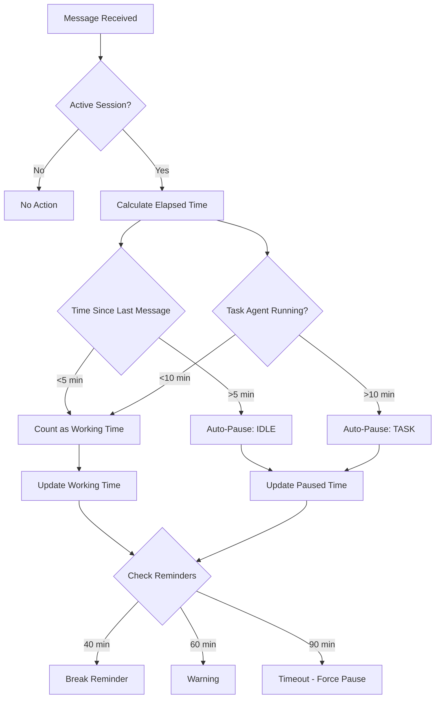

# Session State Schema Reference

JSON schema for `.claude/session-state.json` file.

**Audience**: Developers implementing session management or debugging session state.

**See also**:
- [Session Commands](session-commands.md) - Commands that modify state
- [Run a Session](../how-to/run-a-session.md) - Complete workflow

---

## Overview

**File**: `.claude/session-state.json`
**Lifecycle**:
- Created: `/session start <task>`
- Updated: Every message (automatic tracking)
- Deleted: `/session stop`

**Purpose**: Track ephemeral runtime session state (time, pauses, reminders).

**Git**: Never committed (included in `.gitignore`).

---

## JSON Schema

```json
{
  "$schema": "http://json-schema.org/draft-07/schema#",
  "title": "Session State",
  "description": "Runtime state for active Claude Code session",
  "type": "object",
  "required": [
    "sessionId",
    "scope",
    "task",
    "branchName",
    "status",
    "startTime",
    "lastMessageTime",
    "actualWorkingMs",
    "totalPausedMs",
    "pauses",
    "reminders",
    "summary"
  ],
  "properties": {
    "sessionId": {
      "type": "string",
      "pattern": "^[0-9]{8}-.+$",
      "description": "Unique session identifier: YYYYMMDD-scope-task",
      "examples": [
        "20251104-domain-databasename",
        "20251105-infrastructure-inmemory"
      ]
    },
    "scope": {
      "type": "string",
      "description": "Hill chart scope name this session contributes to",
      "examples": [
        "Domain Layer Foundation",
        "Filesystem Adapter",
        "CLI Layer"
      ]
    },
    "task": {
      "type": "string",
      "description": "Specific task description (2-4 words)",
      "examples": [
        "Create DatabaseName value object",
        "Implement directory provisioning",
        "Wire install command"
      ]
    },
    "branchName": {
      "type": "string",
      "pattern": "^session/[0-9]{8}-.+$",
      "description": "Git branch name for this session",
      "examples": [
        "session/20251104-domain-databasename",
        "session/20251105-infrastructure-inmemory"
      ]
    },
    "status": {
      "type": "string",
      "enum": ["IN_PROGRESS", "PAUSED"],
      "description": "Current session status"
    },
    "startTime": {
      "type": "string",
      "format": "date-time",
      "description": "ISO 8601 timestamp when session started",
      "examples": ["2025-11-04T10:23:15Z"]
    },
    "lastMessageTime": {
      "type": "string",
      "format": "date-time",
      "description": "ISO 8601 timestamp of last message (for idle detection)",
      "examples": ["2025-11-04T10:45:32Z"]
    },
    "actualWorkingMs": {
      "type": "integer",
      "minimum": 0,
      "description": "Milliseconds of actual working time (excludes pauses)"
    },
    "totalPausedMs": {
      "type": "integer",
      "minimum": 0,
      "description": "Total milliseconds paused (sum of all pause durations)"
    },
    "pauses": {
      "type": "array",
      "description": "History of all pauses during session",
      "items": {
        "type": "object",
        "required": ["type", "reason", "startTime"],
        "properties": {
          "type": {
            "type": "string",
            "enum": ["AUTO_TASK", "AUTO_IDLE", "MANUAL"],
            "description": "Pause trigger type"
          },
          "reason": {
            "type": "string",
            "description": "Why pause occurred",
            "examples": [
              "Task agent: codebase exploration",
              "User idle",
              "lunch",
              "meeting"
            ]
          },
          "startTime": {
            "type": "string",
            "format": "date-time",
            "description": "When pause started"
          },
          "endTime": {
            "type": "string",
            "format": "date-time",
            "description": "When pause ended (null if ongoing)"
          },
          "durationMs": {
            "type": "integer",
            "minimum": 0,
            "description": "Pause duration in milliseconds"
          }
        }
      }
    },
    "reminders": {
      "type": "object",
      "description": "Which reminders have been triggered",
      "properties": {
        "break40min": {
          "type": "boolean",
          "description": "Break reminder triggered at 40 min working time"
        },
        "warning60min": {
          "type": "boolean",
          "description": "Warning triggered at 60 min working time"
        },
        "timeout90min": {
          "type": "boolean",
          "description": "Timeout triggered at 90 min working time (hard pause)"
        }
      },
      "required": ["break40min", "warning60min", "timeout90min"]
    },
    "summary": {
      "type": "string",
      "description": "One-line summary of session work (updated during session)",
      "examples": [
        "Creating DatabaseName value object with validation",
        "Implementing in-memory repository interfaces"
      ]
    }
  }
}
```

---

## Field Descriptions

### sessionId

**Type**: String (pattern: `YYYYMMDD-scope-task`)

**Purpose**: Unique identifier for session, matches branch name suffix.

**Format**: ISO 8601 compact date + scope + task (lowercase, hyphen-separated)

**Examples**:
```json
"sessionId": "20251104-domain-databasename"
"sessionId": "20251105-infrastructure-inmemory"
"sessionId": "20251108-test-installation-workflow"
```

**Usage**: Correlate session with git branch and commit history.

### scope

**Type**: String (free-form)

**Purpose**: Link session to hill chart scope.

**Examples**:
```json
"scope": "Domain Layer Foundation"
"scope": "Filesystem Adapter"
"scope": "CLI Layer"
```

**Usage**: Track which scope is actively being worked on.

### task

**Type**: String (free-form, brief)

**Purpose**: Human-readable task description.

**Brevity**: 2-4 words preferred.

**Examples**:
```json
"task": "Create DatabaseName value object"
"task": "Implement directory provisioning"
"task": "Wire install command to use cases"
```

**Usage**: Displayed in status messages, cycle file updates.

### branchName

**Type**: String (pattern: `session/YYYYMMDD-scope-task`)

**Purpose**: Git branch for this session's work.

**Format**: Always starts with `session/`, followed by sessionId.

**Examples**:
```json
"branchName": "session/20251104-domain-databasename"
"branchName": "session/20251105-infrastructure-inmemory"
```

**Usage**: Git operations (checkout, merge, delete).

### status

**Type**: Enum (`IN_PROGRESS` | `PAUSED`)

**Purpose**: Current session state.

**Values**:
- `IN_PROGRESS`: Active work, timer running
- `PAUSED`: Timer stopped, not accumulating working time

**Transitions**:
- `IN_PROGRESS` → `PAUSED`: Manual pause, auto-pause (task/idle), timeout
- `PAUSED` → `IN_PROGRESS`: Resume (manual or automatic)

**Examples**:
```json
"status": "IN_PROGRESS"
"status": "PAUSED"
```

### startTime

**Type**: String (ISO 8601 date-time)

**Purpose**: When session was started via `/session start`.

**Format**: UTC timezone preferred (Z suffix).

**Examples**:
```json
"startTime": "2025-11-04T10:23:15Z"
"startTime": "2025-11-05T14:30:00Z"
```

**Usage**: Calculate total elapsed time, display in status.

### lastMessageTime

**Type**: String (ISO 8601 date-time)

**Purpose**: Timestamp of most recent message (for idle detection).

**Updated**: Every message from user or Claude.

**Usage**: Detect idle >5 min → trigger auto-pause.

**Examples**:
```json
"lastMessageTime": "2025-11-04T10:45:32Z"
```

**Calculation**:
```javascript
const idleMs = Date.now() - new Date(lastMessageTime).getTime();
if (idleMs > 5 * 60 * 1000) {
  // Trigger AUTO_IDLE pause
}
```

### actualWorkingMs

**Type**: Integer (milliseconds)

**Purpose**: Cumulative working time, excluding pauses.

**Always**: `>= 0`

**Examples**:
```json
"actualWorkingMs": 2100000  // 35 minutes
"actualWorkingMs": 2520000  // 42 minutes
```

**Calculation**:
```javascript
// Total elapsed time
const totalMs = endTime - startTime;

// Subtract all pauses
const workingMs = totalMs - totalPausedMs;
```

**Display Conversion**:
```javascript
const minutes = Math.floor(actualWorkingMs / 60000);
const seconds = Math.floor((actualWorkingMs % 60000) / 1000);
```

### totalPausedMs

**Type**: Integer (milliseconds)

**Purpose**: Sum of all pause durations.

**Always**: `>= 0`

**Examples**:
```json
"totalPausedMs": 120000   // 2 minutes
"totalPausedMs": 480000   // 8 minutes
```

**Calculation**:
```javascript
const totalPausedMs = pauses.reduce((sum, pause) => sum + pause.durationMs, 0);
```

### pauses

**Type**: Array of pause objects

**Purpose**: Complete history of pauses during session.

**Pause Object Schema**:
```json
{
  "type": "AUTO_TASK" | "AUTO_IDLE" | "MANUAL",
  "reason": "string",
  "startTime": "ISO 8601 timestamp",
  "endTime": "ISO 8601 timestamp | null",
  "durationMs": integer
}
```

**Pause Types**:
- `AUTO_TASK`: Task agent running >10 min
- `AUTO_IDLE`: User idle >5 min
- `MANUAL`: User called `/session pause`

**Examples**:

**Auto-pause for Task agent**:
```json
{
  "type": "AUTO_TASK",
  "reason": "Task agent: Explore codebase architecture",
  "startTime": "2025-11-04T10:30:00Z",
  "endTime": "2025-11-04T10:42:00Z",
  "durationMs": 720000
}
```

**Auto-pause for idle**:
```json
{
  "type": "AUTO_IDLE",
  "reason": "User idle",
  "startTime": "2025-11-04T10:50:00Z",
  "endTime": "2025-11-04T10:57:00Z",
  "durationMs": 420000
}
```

**Manual pause**:
```json
{
  "type": "MANUAL",
  "reason": "lunch",
  "startTime": "2025-11-04T11:30:00Z",
  "endTime": "2025-11-04T12:00:00Z",
  "durationMs": 1800000
}
```

**Ongoing pause** (endTime null):
```json
{
  "type": "MANUAL",
  "reason": "meeting",
  "startTime": "2025-11-04T14:00:00Z",
  "endTime": null,
  "durationMs": 0
}
```

### reminders

**Type**: Object with boolean flags

**Purpose**: Track which progressive reminders have been shown.

**Properties**:
- `break40min`: Gentle reminder at 40 min working time
- `warning60min`: Strong warning at 60 min working time
- `timeout90min`: Hard timeout at 90 min working time

**Prevents**: Re-showing same reminder multiple times.

**Examples**:

**No reminders yet** (early session):
```json
{
  "break40min": false,
  "warning60min": false,
  "timeout90min": false
}
```

**Break reminder triggered**:
```json
{
  "break40min": true,
  "warning60min": false,
  "timeout90min": false
}
```

**Warning triggered**:
```json
{
  "break40min": true,
  "warning60min": true,
  "timeout90min": false
}
```

**Timeout triggered** (hard pause):
```json
{
  "break40min": true,
  "warning60min": true,
  "timeout90min": true
}
```

**Update Logic**:
```javascript
if (actualWorkingMs >= 40 * 60 * 1000 && !reminders.break40min) {
  showBreakReminder();
  reminders.break40min = true;
}

if (actualWorkingMs >= 60 * 60 * 1000 && !reminders.warning60min) {
  showWarning();
  reminders.warning60min = true;
}

if (actualWorkingMs >= 90 * 60 * 1000 && !reminders.timeout90min) {
  forcePause();
  reminders.timeout90min = true;
}
```

### summary

**Type**: String (one-line description)

**Purpose**: Brief summary of session work.

**Updated**: Can be updated during session as work evolves.

**Examples**:
```json
"summary": "Creating DatabaseName value object with validation"
"summary": "Implementing in-memory repository interfaces"
"summary": "Debugging port validation edge cases"
```

**Usage**: Displayed in status, used in cycle file updates.

---

## Complete Example

**Typical session** (active, one auto-pause):

```json
{
  "sessionId": "20251104-domain-databasename",
  "scope": "Domain Layer Foundation",
  "task": "Create DatabaseName value object",
  "branchName": "session/20251104-domain-databasename",
  "status": "IN_PROGRESS",
  "startTime": "2025-11-04T10:23:15Z",
  "lastMessageTime": "2025-11-04T10:58:42Z",
  "actualWorkingMs": 2100000,
  "totalPausedMs": 120000,
  "pauses": [
    {
      "type": "AUTO_TASK",
      "reason": "Task agent: Search for validation patterns",
      "startTime": "2025-11-04T10:35:00Z",
      "endTime": "2025-11-04T10:47:00Z",
      "durationMs": 720000
    }
  ],
  "reminders": {
    "break40min": false,
    "warning60min": false,
    "timeout90min": false
  },
  "summary": "Creating DatabaseName value object with validation"
}
```

**Complex session** (paused, multiple pauses, reminders triggered):

```json
{
  "sessionId": "20251105-infrastructure-filesystem",
  "scope": "Filesystem Adapter",
  "task": "Implement directory provisioning",
  "branchName": "session/20251105-infrastructure-filesystem",
  "status": "PAUSED",
  "startTime": "2025-11-05T14:15:30Z",
  "lastMessageTime": "2025-11-05T15:48:10Z",
  "actualWorkingMs": 3600000,
  "totalPausedMs": 900000,
  "pauses": [
    {
      "type": "AUTO_TASK",
      "reason": "Task agent: Explore filesystem adapter patterns",
      "startTime": "2025-11-05T14:25:00Z",
      "endTime": "2025-11-05T14:38:00Z",
      "durationMs": 780000
    },
    {
      "type": "MANUAL",
      "reason": "coffee break",
      "startTime": "2025-11-05T15:05:00Z",
      "endTime": "2025-11-05T15:12:00Z",
      "durationMs": 420000
    },
    {
      "type": "MANUAL",
      "reason": "meeting",
      "startTime": "2025-11-05T15:48:10Z",
      "endTime": null,
      "durationMs": 0
    }
  ],
  "reminders": {
    "break40min": true,
    "warning60min": true,
    "timeout90min": false
  },
  "summary": "Implementing directory provisioning with permission handling"
}
```

**Session at timeout** (90 min, hard pause):

```json
{
  "sessionId": "20251106-cli-install-wiring",
  "scope": "CLI Layer",
  "task": "Wire install command to use cases",
  "branchName": "session/20251106-cli-install-wiring",
  "status": "PAUSED",
  "startTime": "2025-11-06T16:20:00Z",
  "lastMessageTime": "2025-11-06T17:53:15Z",
  "actualWorkingMs": 5400000,
  "totalPausedMs": 180000,
  "pauses": [
    {
      "type": "AUTO_IDLE",
      "reason": "User idle",
      "startTime": "2025-11-06T16:55:00Z",
      "endTime": "2025-11-06T17:01:00Z",
      "durationMs": 360000
    },
    {
      "type": "AUTO_TASK",
      "reason": "Timeout enforced at 90 min working time",
      "startTime": "2025-11-06T17:53:15Z",
      "endTime": null,
      "durationMs": 0
    }
  ],
  "reminders": {
    "break40min": true,
    "warning60min": true,
    "timeout90min": true
  },
  "summary": "Wiring install command - TIMEOUT enforced, take break"
}
```

---

## State Transitions

### Session Start

**Trigger**: `/session start <task>`

**Initial State**:
```json
{
  "sessionId": "20251104-domain-task",
  "scope": "Domain Layer Foundation",
  "task": "Create value object",
  "branchName": "session/20251104-domain-task",
  "status": "IN_PROGRESS",
  "startTime": "2025-11-04T10:00:00Z",
  "lastMessageTime": "2025-11-04T10:00:00Z",
  "actualWorkingMs": 0,
  "totalPausedMs": 0,
  "pauses": [],
  "reminders": {
    "break40min": false,
    "warning60min": false,
    "timeout90min": false
  },
  "summary": "Starting work on value object"
}
```

### Message Received (Working)

**Trigger**: User or Claude message, `status: IN_PROGRESS`

**Updates**:
1. `lastMessageTime` = current timestamp
2. `actualWorkingMs` += elapsed since last message (if <5 min)
3. Check reminders, update flags if thresholds crossed

**State**: Remains `IN_PROGRESS`

### Message Received (Idle Detected)

**Trigger**: >5 min since `lastMessageTime`

**Updates**:
1. Calculate idle duration: `now - lastMessageTime`
2. Create `AUTO_IDLE` pause entry
3. `status` = `PAUSED`
4. `totalPausedMs` += idle duration

### Task Agent Started

**Trigger**: Task tool invoked

**Updates**:
1. Note start time
2. If agent runs >10 min:
   - Create `AUTO_TASK` pause entry
   - `status` = `PAUSED`
   - `totalPausedMs` += agent duration

### Manual Pause

**Trigger**: `/session pause [reason]`

**Updates**:
1. `status` = `PAUSED`
2. Create `MANUAL` pause entry with `endTime: null`
3. Display paused message

### Resume

**Trigger**: `/session resume` or automatic (next message after auto-pause)

**Updates**:
1. Find active pause (where `endTime: null`)
2. Set `endTime` = current timestamp
3. Calculate `durationMs`
4. Update `totalPausedMs`
5. `status` = `IN_PROGRESS`

### Session Stop

**Trigger**: `/session stop`

**Action**: File deleted entirely (state no longer needed).

---

## Update Frequency

**Every message**:
- `lastMessageTime`
- `actualWorkingMs` (if status IN_PROGRESS)
- Reminder checks

**On pause**:
- `status` → `PAUSED`
- New pause entry added
- `totalPausedMs` updated (if pause ended)

**On resume**:
- `status` → `IN_PROGRESS`
- Active pause closed (endTime set)
- `totalPausedMs` updated

---

## Auto-Pause Logic Diagram



---

## File Location and Git

**Path**: `.claude/session-state.json`

**Gitignore**: MUST be ignored (ephemeral runtime data).

Add to `.gitignore`:
```
# Session state (ephemeral runtime data)
.claude/session-state.json
```

**Backup**: Not necessary (recreated on next session start).

**Portability**: NOT portable between machines (timestamps, local state).

---

## Validation

**JSON Schema Validation** (optional, for implementation):

```javascript
const Ajv = require('ajv');
const ajv = new Ajv();

const schema = {
  // ... full schema from above ...
};

const validate = ajv.compile(schema);

const sessionState = JSON.parse(fs.readFileSync('.claude/session-state.json'));

if (validate(sessionState)) {
  console.log('Valid session state');
} else {
  console.error('Invalid session state:', validate.errors);
}
```

**Field Validation**:
- `sessionId`: Must match `branchName` suffix
- `actualWorkingMs` + `totalPausedMs` ≈ `now - startTime` (minor drift acceptable)
- Pauses array: Sum of `durationMs` must equal `totalPausedMs`
- Status: Must be one of two enum values

---

## Related Documentation

- [Session Commands](session-commands.md) - Commands that modify state
- [Run a Session](../how-to/run-a-session.md) - Complete workflow
- [Commit Format](commit-format.md) - Session metadata in commits
- [Shape Up and Sessions](../explanation/shape-up-and-sessions.md) - Methodology overview
